# 一、课程介绍

## （一）课程体系

### 1. 简单理解BERTopic

### 2. 环境配置

### 3. 词嵌入模型

1. Bert-Base-Chinese

2. 哈工大模型

3. SentenceTransformers框架

### 4. 主题聚类

1. 超参数调节

2. 减少离群值

3. 可视化

### 5. 层次主题模型

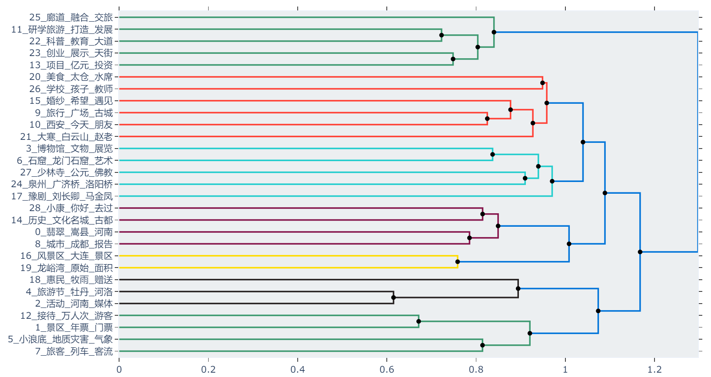

### 6. 动态主题模型

1. 超参数调节

### 7. BERTopic代码编写与论文写作经验

## （二）课程资料

### 1. 笔记

### 2. 开源代码

# 二、BERTopic直观理解

## （一）BERTopic原理示意图

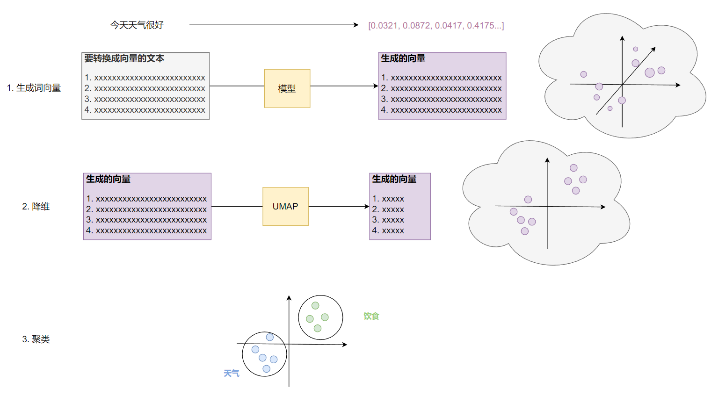

## （二）代码

`test\test-bertopic-start\get_topic_simple.ipynb`

# 三、环境配置

## （一）安装：anaconda

### 1. 理解：为什么需要anaconda

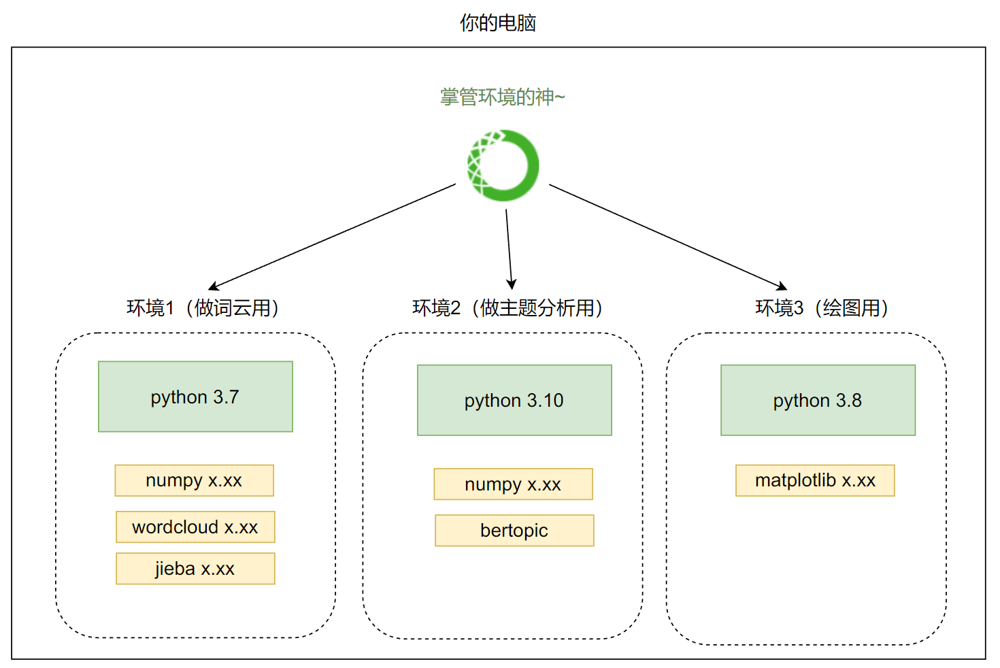

### 2. 下载anaconda

[anaconda](https://www.anaconda.com/download)

下载好，双击安装，一直下一步

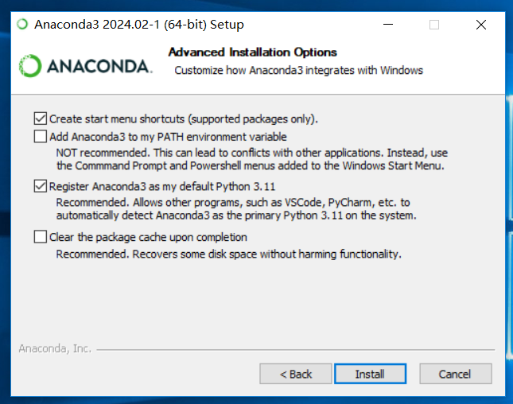

### 3. 启动anaconda

在开始菜单，找到anaconda powershell prompt，输入`conda`，有输出即可

这样我们就有了管理python版本、依赖包版本的工具

## （二）安装：python环境

1. 安装python 3.10.6

`conda create -n test python=3.10.6`

2. 激活环境

`conda activate test`

然后输入`python`，发现python3.10.6安装好了

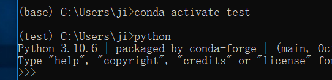

## （三）安装：依赖包

### 1. 第一步：先安装hdbscan ⚠️

#### hdbscan的安装问题

因为BERTopic依赖HDBSCAN这个包

但当前版本，使用pip安装HDBSCAN这个包，会报错

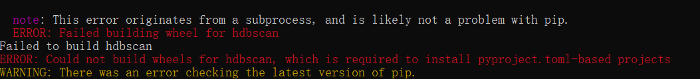

下面是两个相关讨论，里面有解决方案

[https://www.google.com.hk/url?sa=t&rct=j&q=&esrc=s&source=web&cd=&ved=2ahUKEwjdmK6IqqKFAxX3TGcHHfgmDQoQFnoECA8QAQ&url=https%3A%2F%2Fgithub.com%2FMaartenGr%2FBERTopic%2Fissues%2F816&usg=AOvVaw3F5j2NSu0dkw5xUZP2WMNc&opi=89978449](https://www.google.com.hk/url?sa=t&rct=j&q=&esrc=s&source=web&cd=&ved=2ahUKEwjdmK6IqqKFAxX3TGcHHfgmDQoQFnoECA8QAQ&url=https%3A%2F%2Fgithub.com%2FMaartenGr%2FBERTopic%2Fissues%2F816&usg=AOvVaw3F5j2NSu0dkw5xUZP2WMNc&opi=89978449)

[https://github.com/MaartenGr/BERTopic/issues/1656](https://github.com/MaartenGr/BERTopic/issues/1656)

#### 解决方案

##### 1. 安装build-tools-for-visual-studio

注意，这个解决方案中说，需要先安装build-tools-for-visual-studio，但是在我的电脑（win10虚拟机）上实测是不需要先安装这个的，大家可以先跳过这个步骤，直接安装hdbscan，如果安装不上去，再拐回来下载build-tools-for-visual-studio，安装并重启电脑，重新打开prompt窗口，然后继续执行后面的步骤

下载地址

[https://visualstudio.microsoft.com/downloads/#build-tools-for-visual-studio-2022](https://visualstudio.microsoft.com/downloads/#build-tools-for-visual-studio-2022)

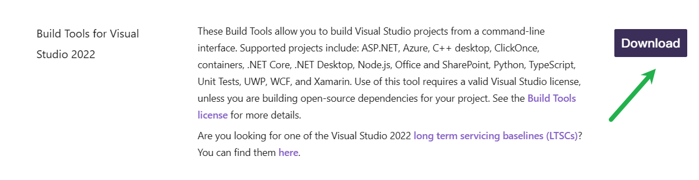

##### 2. 安装hdbscan

先通过conda安装hdbscan

`conda install -c conda-forge hdbscan`

这里输入`y`，包括python在内的一些包会被更新，但是没关系，仍然具备兼容性

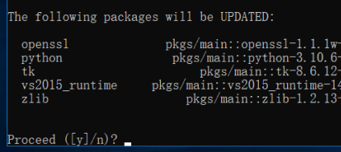

接下来就能使用pip进行安装了

### 2. 第二步：再安装其他依赖包

1. 设置pip换源

`pip config set global.index-url https://pypi.tuna.tsinghua.edu.cn/simple`

[https://mirrors.tuna.tsinghua.edu.cn/help/pypi/](https://mirrors.tuna.tsinghua.edu.cn/help/pypi/)

2. 安装依赖

`pip install torch==2.0.1 transformers==4.29.1 tqdm==4.65.0 numpy==1.23.2 jieba==0.42.1 bertopic==0.15.0`

如果安装出错，可以先尝试**重复运行该安装命令**

## （四）安装：编辑器（vscode）

### 1. 安装vscode

[https://code.visualstudio.com/](https://code.visualstudio.com/)

下载后双击安装并一直下一步，然后打开软件

然后我们可以创建一个文件夹

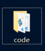

里面创建两个文件

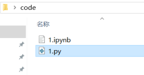

然后用vscode打开该文件夹

打开文件夹时会有安全提示，直接点击trust就可以了

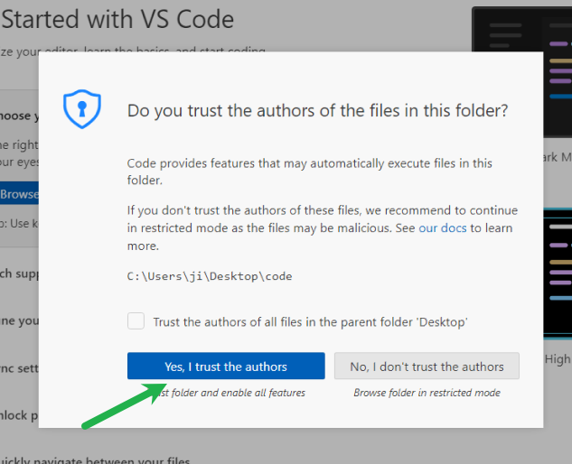

### 2. 安装必要插件

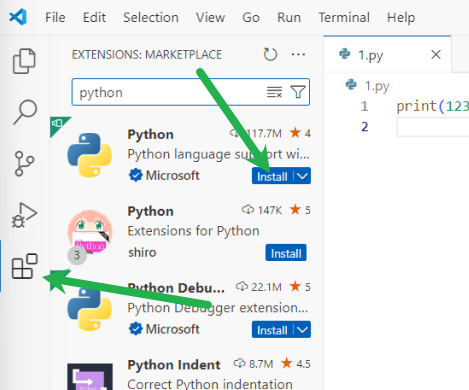

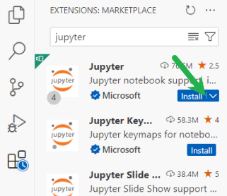

### 3. 是什么

在许多编辑器当中，都会有一个让选择Python解释器的步骤，这一步的意思是：让编辑器链接到具体环境

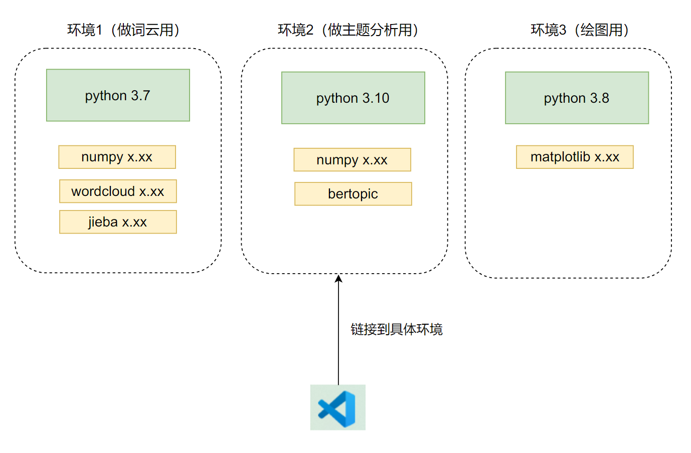

### 4. 选择python解释器，并运行代码

#### 运行py文件

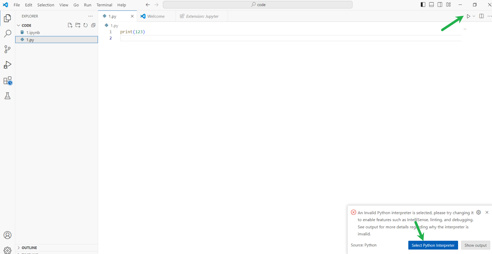

选择test环境

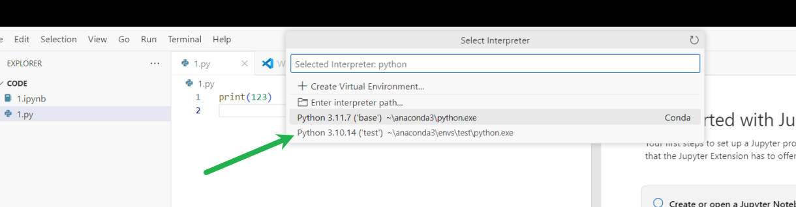

运行结果

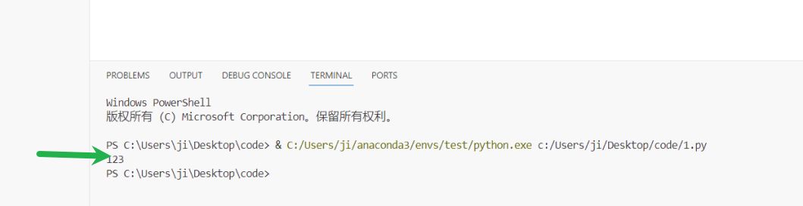

如果不小心选错了环境，可以点击vs code的右下角来切换环境

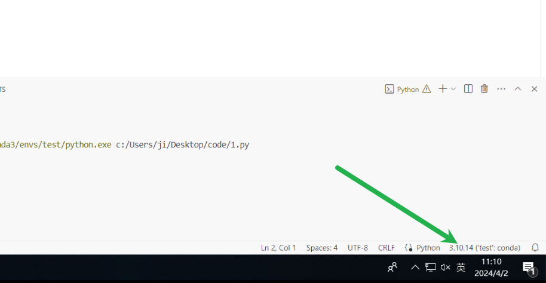

#### 运行ipynb文件

写入代码，然后点击运行

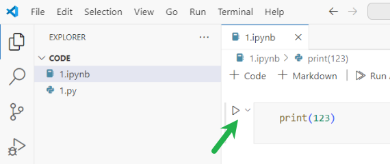

会让选择环境

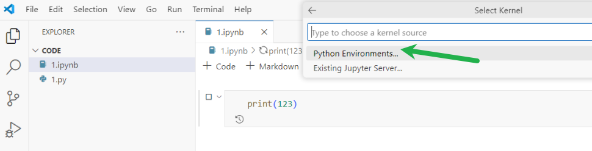

选择test环境

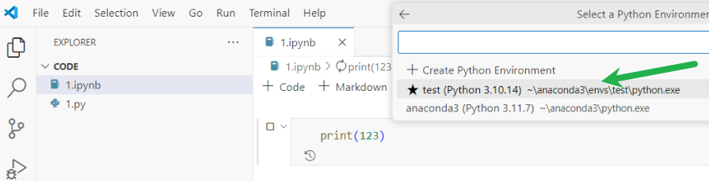

会弹出这个提醒，点击安装

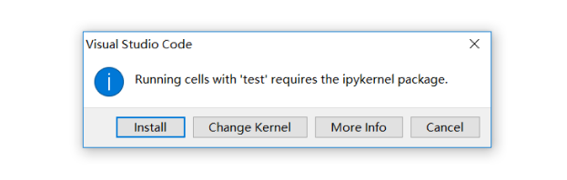

然后就可以看到运行结果了

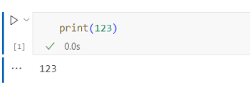

## （五）实战：把代码跑起来

### 1. 运行代码

打开code目录，按下图所示，一直打开到`get_topic_simple.ipynb`，逐行执行即可

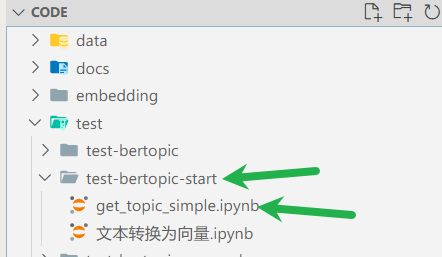

### 2. 疑难：使用huggingface镜像下载模型

注意在执行到下面这行代码的时候，需要下载模型，此时需要梯子

`embedding_model = SentenceTransformer('paraphrase-multilingual-MiniLM-L12-v2')`

如果实在没有梯子，也可以使用huggingface镜像，参考如下文章

[国内快速下载huggingface（镜像）上的模型和数据 - 知乎](https://zhuanlan.zhihu.com/p/685765714)

下面是官方教程

[HF-Mirror - Huggingface 镜像站](https://hf-mirror.com/)

具体而言：

1. 打开Anaconda powershell  prompt

2. 激活环境

`conda activate test`

2. 安装依赖

`pip install -U huggingface_hub`

3. 设置环境变量，即使用huggingface镜像站

Linux平台，在命令行执行

`export HF_ENDPOINT=https://hf-mirror.com`

Windows Powershell，在命令行执行，注意这里必须使用powershell

`$env:HF_ENDPOINT = "https://hf-mirror.com"`

注意这个是在当前powershell会话中临时设置环境变量，所以如果关闭powershell而后重新打开，则需要重新运行该命令设置环境变量

4. 下载模型

`huggingface-cli download --resume-download 模型名`

如

`huggingface-cli download --resume-download sentence-transformers/paraphrase-multilingual-MiniLM-L12-v2`

模型名需要去huggingface镜像站进行查询，以获取精确的模型名称

[hf-mirror](https://hf-mirror.com/models)

注意：如果下载失败，可以重复执行上面的命令，来继续下载

# 四、词向量：使用Bert-Base-Chinese

## （一）理解：我们要做什么

1. 简单来说就是，要把文本转成的向量并缓存到本地，用的时候再加载回来，以节约时间。

在BERTopic模型整个运算过程中，文本转向量是最耗时的，如果每次运行都重新生成文本的语义向量，那时间成本是不可接受的。

所以我们需要先把文本转换成向量，保存成本地文件。这样在用BERTopic模型的时候就无需训练，直接从本地加载即可

代码：`get_topic_use_emb.ipynb`

2. 学习不同的词嵌入向量

## （二）理解：我们要怎么做

### 1. 将文本转向量

简而言之，本章就是要学习一些模型，通过这些模型，可以把要聚类的文本转换成向量，然后保存在本地

文本就是一串文字，语义向量就是一串数字

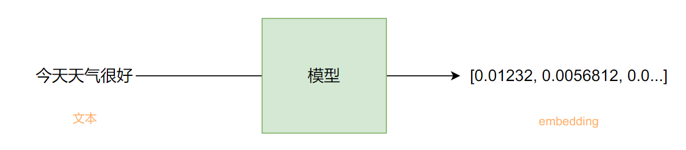

转换成数值之后

好处之一在于：文本形式不太方便输入计算机中进行计算，但数值形式很方便输入计算机中进行计算

好处之二在于：通过深度学习模型可以实现如下效果：语义比较相似的文本，转换为向量之后，向量的距离也会比较相近。

将文本转换为向量之后，如果我们通过一些聚类算法，把距离比较相近的向量聚在一块儿，就实现了文本聚类。

这其实也是BERTopic的整体思想：先将文本转换为向量，再降维，再聚类

通过下面这个例子，可以很清晰的理解

代码：`文本转换为向量.ipynb`

### 2. 学习文本转向量的不同模型

把文本转换成向量，并且要实现语义相似的文本生成的向量在空间中也相近，并不是一件容易的事情，对此研究人员提出了不同的模型

不同的模型有不同的训练方法，也有不同的转换效果

在自然语言处理方面，大家比较常听到的模型可能包括

1. one-hot编码

2. word2vec模型

3. bert系列模型（如bert-base-chinese）

4. 还有SentenceTransformers框架（注意这其实是个框架，通过该框架可以调用很多模型）

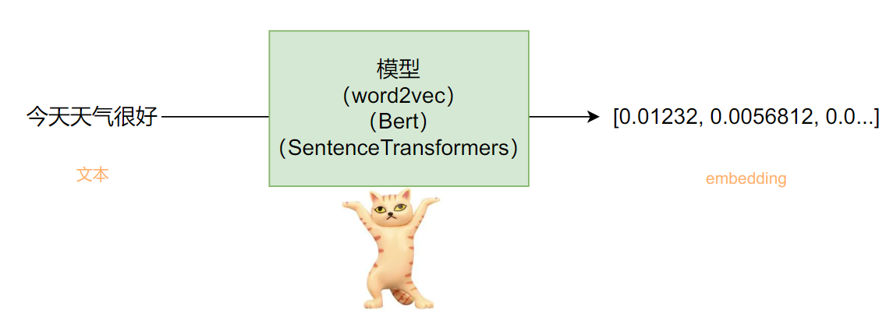

在理论部分

我们会从经典的one-hot编码开始，进行非常通俗简单的讲解，让大家对不同模型的基本原理有一个直观了解

在实战章节

我们要学习如下模型

经典的bert-base-chinese

哈工大基于全词掩码的中文bert

sentencetransformers中的一些模型

因为这些模型生成的词向量各有特色，大家在处理具体任务、写论文的时候，可以去尝试使用不同的模型，看看用哪个模型生成的词向量做文本聚类得出的结果效果更好

## （三）理论：模型介绍（one-hot、word2vec、bert-base-chinese）

### 1. 是什么 

本章我们来简单介绍一些经典的词向量模型

说白了词向量模型只做一件事：**将文本转换为数值**

在过去漫长的时间中，研究人员提出了不同的方案

### 2. one-hot编码

#### 是什么

最简单的当属one-hot编码

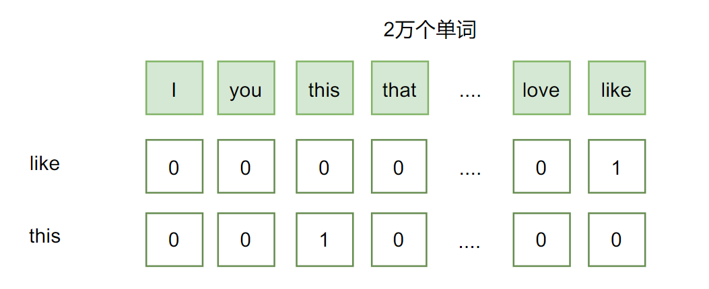

one-hot就是，只有一位为1，其余都为0

#### 缺点

one-hot编码的缺点

1. 稀疏性：编码之后可能有一堆0，一个1。数据内容非常大，计算代价也很高昂

2. 缺乏语义：没有办法实现语义相似的词语，向量也相近。因为one-hot编码就没有考虑语义，它只是将出现的单词标记为1，没出现的单词标记为0而已。

参考资料：

[NLP修炼系列之词向量（一）详解one-hot编码&实战 - 知乎](https://zhuanlan.zhihu.com/p/595664193)

### 3. word2vec模型

#### 要做什么

上面是one-hot编码，太长了（两万位），太稀疏了（差不多都是0），而且没有语义关系

能不能，短一些，每个位置都有具体数值，而且能表示语义关系

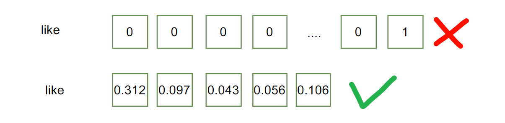

所谓的语义关系：比如：like、love词意相似，则他们对应的向量也会比较相似，或者说在空间中会比较接近

word2vec能实现这个效果

[https://www.bilibili.com/video/BV1MS4y147js/?p=10&spm_id_from=pageDriver&vd_source=eace37b0970f8d3d597d32f39dec89d8](https://www.bilibili.com/video/BV1MS4y147js/?p=10&spm_id_from=pageDriver&vd_source=eace37b0970f8d3d597d32f39dec89d8)

#### 怎么做到的

##### 简单理解

[想请问哪位大佬能告诉我word2vec到底是干嘛的吗，看了一些文章都没看懂，求助？ - 知乎](https://www.zhihu.com/question/478937646)

word2vec基于如下简单思想

“一个词被它周围的词代表。”——John Rupert Firth（英国语言学家）

或者说，语义上相似的单词会出现在相似的上下文中

举例而言

我“喜欢”自然语言处理

我“喜欢”吃苹果

我“喜欢”你

试想一下，这些“喜欢”是不是都可以替换为“爱”呢

当上文是“我”，下文是“自然语言处理”的时候，

其实填入“喜欢”，或填入“爱”都是可以的，相同的上下文可以填入语义相近的词语，一个词的语义被他的上下文词所代表

但是在训练的时候，该怎么去具体实现：一个词的语义被他的上下文所代表呢

##### 怎么训练

注意：这里用一个非常简单的例子来说明怎么达成该效果，和word2vec模型的真正架构有所区别

举例而言

假如说我们有很多语料，比如有一本1000w字长的小说，这本小说是正常人类写的，他的语句符合人类正常表达

然后我们统计了一下，发现这篇小说一共用到2w个单词：a、the、this、that、love、like... zoom

现在我们要为每个单词，生成一个向量表示，并且希望语义上越接近的单词，它的向量表示也应该越接近

好，那我们现在先随机生成每个单词的向量表示：注意每个方块中都是一些随机数

那么显然的，既然是随机生成的，love、like的向量表示应该不会太相近，毕竟是随机的嘛，如果太相似就太巧了

下面我们需要来更新每个词语的向量表示，使love、like的向量比较接近

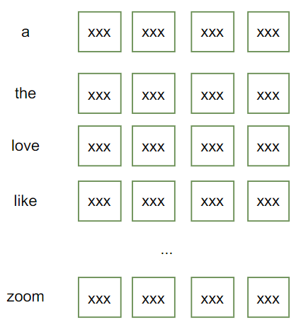

怎么更新呢，现在我们回到原始语料，假如看到原文中有这样一句话

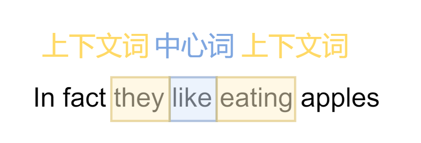

这句话是语料中的话，由正常人类书写，代表了一种正常人经常会说的表达

我们把like叫做中心词，they、eating叫做上下文词

这一定程度上代表了：like经常和they一起出现、like经常和eating一起出现

现在我们要寻找一个这样向量表示，可以准确的表达like的语义含义

现在把like和eating对应的随机初始化词向量一起输入神经网络

神经网络中也有一些随机初始化的参数，所谓神经网络，可以把它当做一个黑盒子，其实里面就是一堆加减乘除运算而已

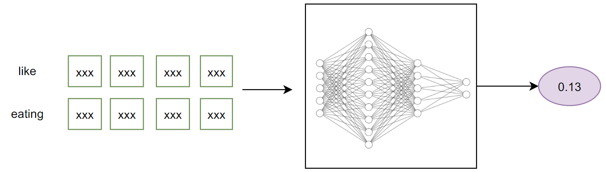

神经网络运算完之后会输出一个结果，比如这里输出的是0.13，我们将这个结果视为“like”和“eating”是上下文的概率

请注意啊，现在：我们like和eating的词向量是随机初始化的；神经网络的参数是随机初始化的；整个运算结果`0.13`就是在这样随机初始化的基础上得出来的，其实到现在为止，这个值并没有太大的意义

但是，我们将输出值定义为：两个输入是上下文的概率，这里就是like和eating是上下文的概率，

因为原文中直接出现了“like eating”所以显然他们是上下文，或者说他们是上下文的概率可以视为1

但是模型输出的结果是0.13，这和1相距甚远

那么接下来就会经过一个叫做反向传播的过程：他会拐回去修改神经网络的参数，也修改like、eating的向量表达，修改的目的是为了让下一次运算的结果尽可能的靠近1

有同学问这可以实现吗，可以让越来越靠近1吗，答案是可以的，这就是神经网络的强大之处，它可以不断减小判断误差，背后的算法原理比如梯度下降之类的我们不过多关注，总之，经过反向传播，模型参数和like、eating的词向量，会被修改，以使最终输出更接近1

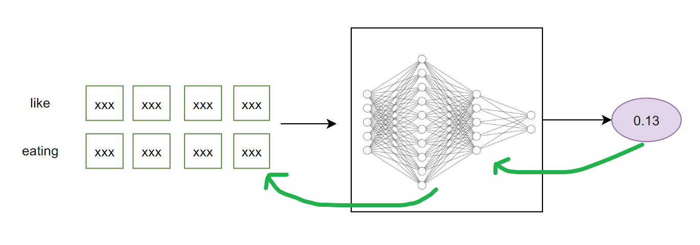

调整之后，下面再来一轮正向传播，注意这时，like、eating对应的词向量已经调整过了，模型的参数也已经调整过了，那么得出的输出可能是0.18，也就更接近1了

其实这个时候我们就可以说，模型一定程度上学习到了like的语义信息，后文我们会更详细地解释

再来看一下负样本

假如我们的语料库中全文都没有出现过“like no”这种表达，也就是说，like和no不存在上下文关系

现在我们把like和no放在一起，输入神经网络，进行前向传播，得出的概率是0.76

也就是模型认为这两者大概率**存在**上下文关系，但显然模型的这个预测是错误的，正确的输出应该是0

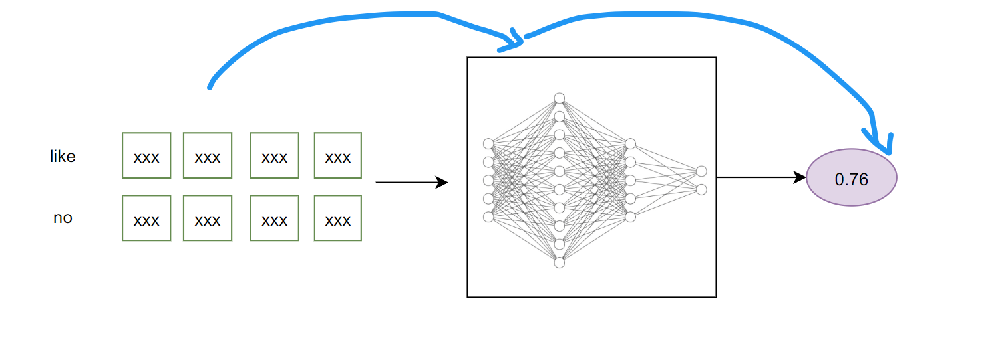

所以同样再经过一轮反向传播，来进一步修改模型参数和like、no的词向量表示

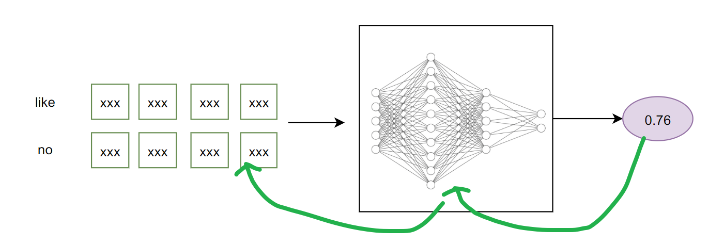

经过反向传播之后，like、no的词向量，神经网络的参数都被修改了

那么下次再进行前向传播，输出结果可能会减小，比如输出0.27，也就说明模型进一步理解了语义关系，认为like和no不太可能是上下文，同样的like、no的词向量也更能准确说明其语义了

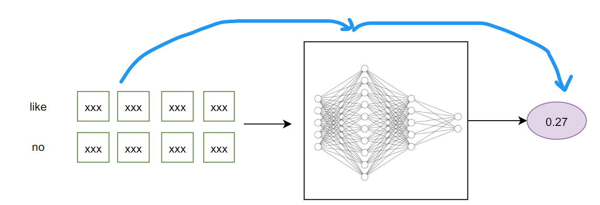

就这样经过上千万次迭代，模型预测的正确率越来越高

当我们最终训练完毕，单词的向量表示和模型的参数都会固定下来，此时向量预测的正确率非常的高

也就是说我们输入任意两个词向量，大概率能正确判断他们是不是上下文

比如输入like和no，模型大概率会输出一个非常靠近零的值，告诉我们他俩不是上下文

其实这就说明，模型学习到了like、no的语义。

大家来仔细理解一下

模型输出的是：两个词是否是上下文的概率

它输出的这个概率正确与否，其实是人类在做判断

比如，like和no不是上下文，这是语料中的表达，这是人的常见表达，这是人类的理解

或者说在模型的输出侧，其实站着“人类”这个裁判

而模型的作用，非常简单，就是尽可能输出正确的结果。大家注意所有的深度学习模型基本上只做一件事情，就是尽可能输出正确的结果，仅此而已。

只要模型能够尽可能输出正确的结果，其实就是说明他越来越能学习到人类的判断，越来越像一个人（当然在这里仅指在判断上下文方面越来越像一个人类），越来越拥有人类智慧

此时就必然要求like的向量表示，逼近人对like的语义理解。

想象一下，假如模型当中like的向量表示其实表示的是dog的含义，那么输入到模型当中进行上下文预测，出错的概率就会很高，就需要回去修正like的向量表示，直到like的向量表示能够真正表达其语义为止

形象来说，模型的输出侧站着一个人类裁判

模型的输入侧，如果表现的不像个人，那模型的预测正确率就会很低

而神经网络又会保证模型预测的正确率不断升高

所以模型的输入侧也会越来越像个人，进而，模型输入侧当中每个单词的向量表示，就越来越能捕获单词的正确语义信息。

那为什么like和love最终的语义向量会比较接近呢

个人觉得可以这样理解，注意这是一些个人理解哈

先抛开模型不谈，我们想象一下，从正常人的角度去理解，如果一段话或者说一个上下文当中可以填入like，那大概率也可以填入love对吧，love和like的上下文是极为相似的

好，现在回归到模型当中，

假如我们将like和no这两个词输入到模型当中，让模型判断他俩是否是上下文

模型如果想要判断正确，他应该尽可能输出一个靠近0的值，代表他俩不太可能是上下文

而假如模型判断的误差比较大，比如输出的是0.7，那他就需要拐回去修改like的向量表示

对like的向量进行修修剪剪，以使得输出结果尽可能靠近0

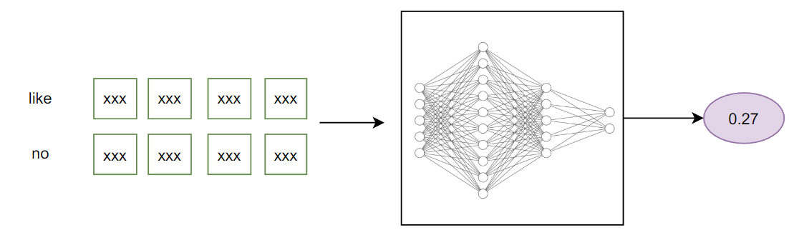

那对于love呢，其实也是如此

把love和no的词向量输入到模型当中，也是期望模型尽可能的输出一个靠近0的数

如果输出的误差比较大，也要拐回去对love的向量进行修修剪剪，以使得下一次输出尽可能的靠近0

注意这里，like和love都经过了这样一个修剪流程，也就是和no向量进行搭配，输入到模型当中，期望模型尽可能输出一个靠近0的数。

经过这样一个相似的修剪流程，like和love的向量表示就会靠近一点

问题是，love和like的上下文搭配，他们不单单会经历**一个**这样的修剪流程。

比如：同时输入I，like，这俩是上下文，我们就希望模型尽可能的输出1，如果模型输出的不是1，就拐回去修修剪剪like的向量表示

对于love也是如此：同时输入I，love，这俩是上下文，我们就希望模型尽可能的输出1，如果模型输出的不是1，就拐回去修修剪剪love的向量表示

经过这一轮修修剪剪， Like和love的向量表示就更接近了一分

而love和like共用的上下文搭配可能有上千个上万个，经过上万轮这样的修修剪剪，like和love的最终向量表示一定会比较接近。这就实现了语义相近的单词向量，表示也接近

此外，大家可以直观的理解一下，word2vec训练出来的词向量，降维到3维，就是空间中的一个个点，两个词语含义越相近，在空间中两个点距离越近

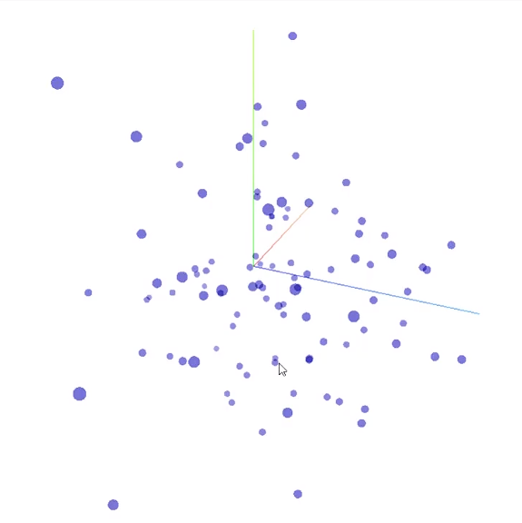

[5-可视化展示_哔哩哔哩_bilibili](https://www.bilibili.com/video/BV1MS4y147js?p=10&vd_source=eace37b0970f8d3d597d32f39dec89d8)

#### word2vec的缺点

1. 无法捕获全文语义

Word2Vec主要关注的是局部上下文，通常是一个词周围的几个词。这种方法虽然能够有效地捕捉到局部的词义关系，但它并不考虑更长的句子范围

2. 无法处理一词多义

Word2Vec不能根据特定的上下文来消除单词的歧义。例如，在Word2Vec中，单词“bank”都具有相同的词向量，无论它出现在金融领域（“我在银行存了一张支票”）还是出现在河流有关的上下文中（“我在钓鱼后坐在河岸上”）。

还有一些其他缺点，此处不过多提及

总而言之：语义捕获还是不够完善，而这可以通过bert模型进一步完善

[想请问哪位大佬能告诉我word2vec到底是干嘛的吗，看了一些文章都没看懂，求助？ - 知乎](https://www.zhihu.com/question/478937646)

### 4. bert模型

#### 要做什么

bert模型是google在2018年提出的一个预训练模型，它基于transformer架构实现，它可以进一步弥补word2vec的缺陷

比如：使用bert生成的句子向量，可以捕获整个句子的信息，而不是局部的，而且可以有效的处理一词多义的情况

总之它生成的词向量、句子向量，语义捕获的更完整

后面的课程我们会简要介绍这些模型，并针对bert系列模型、SentenceTransformers系列模型给出实际案例

#### 怎么做到的

##### 从人的视角来看

下面是一些个人理解，是一些通俗解释，不代表bert的真正训练流程

bert模型捕获语义的强大能力，本质上来自于Transformer架构和self-attention机制，但这里我们通过一个简单的例子进行解释。

举例而言，下面有两句话：

“我喜欢**苹果**，因为它味道香甜”

“我喜欢**苹果**，因为它拍照清晰”

很显然的，这里两个“苹果”，前者代表一种水果，后者代表一个公司品牌

很显然它们存在语义上的区别，那么对应的词向量表示也应该有所不同，但在word2vec中，“苹果”对应的词向量表示始终是一串固定的数值，不会根据语境发生变化。

我们来思考一下这两个句子，苹果到底表达什么含义，是需要通过阅读**整个句子**来决定的

这似乎有一些哲学意味，即每个词的真正含义都不可能脱离其语境，上下文的微妙变化也会使单词的含义发生微妙变化

那到自然语言处理领域

如果我们要将“苹果”表示为词向量，其实应该考虑整个句子的信息

或者说应当将“我”“喜欢”“因为”“它”“味道”“香甜”，这6个词对应的词向量，都取出一部分，混入到苹果对应的词向量当中

或者说，一个句子当中的每个词汇都一定程度上融合了整个句子的信息

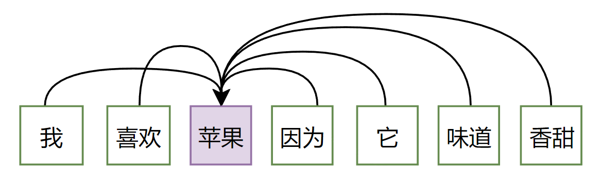

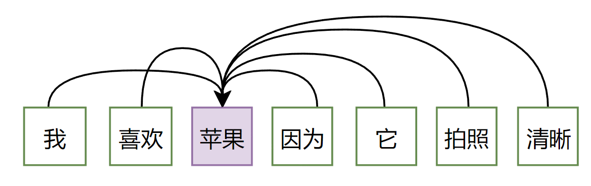

但问题在于，从每个词汇中取出多少呢？这里涉及到一个权重问题

比如说“我喜欢**苹果**，因为它拍照清晰”，我是怎么判断这里的苹果指的是一个品牌呢，我觉得“拍照”这个上下文很关键，因为拍照一般指的是手机的功能，“清晰”也很关键，因为清晰一般不会用来形容一个水果

而“我”“喜欢”“因为”“它”则相对不那么重要

当然“苹果”这个词汇本身肯定需要最重点的去进行关注

所以，要精确表达苹果的语义，我自己大概分配一下各个词汇对应的权重，可能是这样的

我：0.05

喜欢：0.05

**苹果：0.6**

因为：0.05

它：0.05

拍照：0.1

清晰：0.1

在生成向量的时候，也是如此：“苹果”本身的向量保留60%；然后混入10%“拍照”相关的向量，再混入10%“清晰”相关的向量；再混入5%“我”相关的向量；再混入5%“喜欢”相关的向量；再混入5%“因为”相关的向量；再混入5%“它”相关的向量。由此得出的新向量，就是苹果这个单词在整个句子中的更精确语义表示

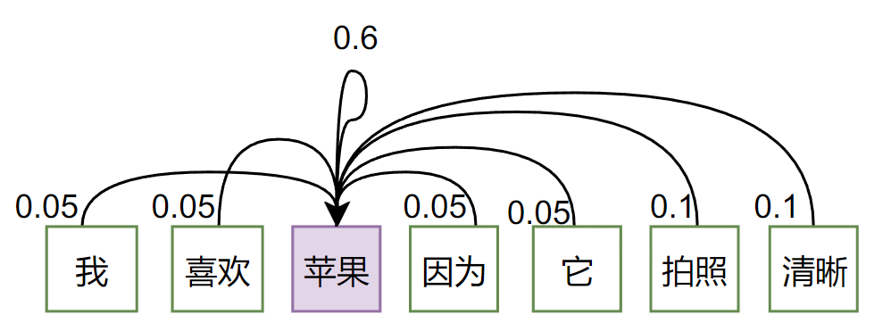

其实上面所说的这个，通过计算权重，来将整个句子的信息混入到当前单词当中，就是Transformer架构的self-attention机制

Self-Attention的核心是：用文本中的其它词来增强目标词的语义表示

[超细节的BERT/Transformer知识点 - 知乎](https://zhuanlan.zhihu.com/p/132554155)

对应到注意力机制的计算公式

绿色部分 * 紫色部分

其实就是：`权重` * `单词语义特征`

比如：`0.1` * `拍照` 的语义特征

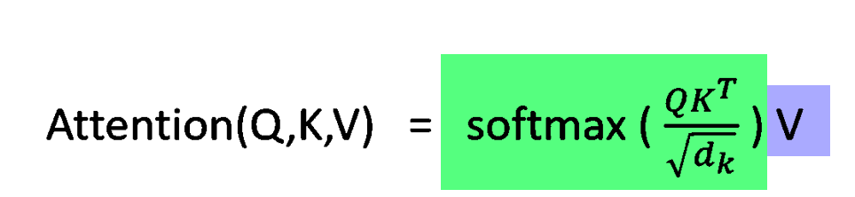

##### 从神经网络视角来看

但问题是，怎么得出正确的权重向量呢，前面的0.6、0.1等是我们人工手动分配的，事实上，该向量权重的分配应当由机器（神经网络）完成，否则都有人工决定，成本就太高了

考虑下面的神经网络

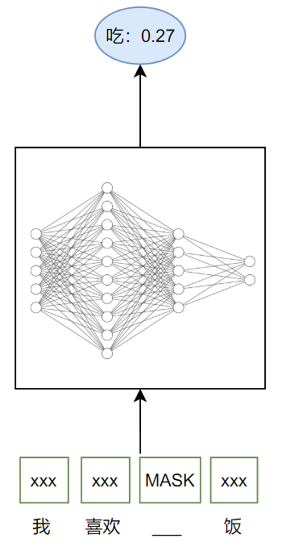

输入就是每个单词对应的向量，注意这个向量是经过混合之后的，也就是每个单词都包含了一定量的全文信息

但是混合时的权重是随机初始化的，所以每个单词的向量表示都不够好

现在其中一个单词被遮蔽掉（mask）了，经过神经网络，让推测出mask位置最可能出现的是什么词。这就像是完形填空一样。

显然地，只有每个单词对应的语义向量足够正确的时候，模型才能输出正确的结果

比如这里输入的是“我喜欢__饭”，期待模型输出“吃”字，或者说希望模型认为这里输出“吃”字的概率是1

但显然的由于我们的权重是随机初始化的，各个单词对应的语义向量其实并不准确，所以模型最终输出：这个位置填入“吃”字的概率是0.27，显然这个数值过小了，我们期待的输出是1

然后通过反向传播，就可以返回去更新权重分配，从而生成更契合语义的向量表示

这样经过无数次训练，模型可能认为这个位置填入“吃”字的概率是0.91，此时整个模型就更能捕获到正确的语义信息了，或者说模型就拥有了正确分配权重的能力

然后我们用无数条这样人类常说的语料去进行训练，比如“我喜欢打球”、“天气真好”等等，到最后整个模型做完形填空基本上都能做对，这样模型就具备了针对各种各样的句子，应当怎么分配注意力权重的能力，这就是通过模型层面实现注意力机制

这其实就是BERT训练当中的MLM任务

但要注意，BERT模型只是说在训练的时候会让做这样的完形填空任务，但其实我们并不是为了得到一个能够做完形填空的机器，而是为了得到它的副产品，即：输入一个句子，模型能通过注意力机制，把整个句子的信息有重点地融入到每个单词的向量表示中，从而得出每个单词良好的语义表示

想象一下，只有模型具备这个能力，即能够非常良好的学习每个单词的语义，他做完形填空的正确率才会高。

我们使用google预训练好的模型时，也是为了拿到每个单词的语义向量，而不是为了让它做完形填空

##### 补充：[CLS]

事实上，在Bert模型运行的时候，它会在输入的句子的最开头插入一个特殊符号[CLS]

这个符号一般用于捕获整个句子的语义信息，而非某个单词的语义信息

[CLS]对应的向量，一般用于下游的分类任务

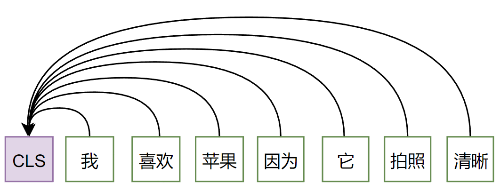

为什么[CLS]能表示整句话语义？

因为与文本中已有的其它词相比，这个**无明显语义信息**的符号会更“公平”地融合文本中各个词的语义信息，从而更好的表示整句话的语义。

[Bert 中[CLS]的意义_bert cls-CSDN博客](https://blog.csdn.net/xiaomi5410/article/details/130677402)

[超细节的BERT/Transformer知识点 - 知乎](https://zhuanlan.zhihu.com/p/132554155)

关于[CLS]捕获的是否是整个语义的信息其实存在一定争议，不过迄今为止使用[CLS]来表示整个句子语义信息仍是一个比较常见的做法，此处我们不过多讨论这一点

相关讨论可以参见下面视频P2

[BERT从零详细解读，看不懂来打我_哔哩哔哩_bilibili](https://www.bilibili.com/video/BV1Ey4y1874y/?spm_id_from=333.337.search-card.all.click&vd_source=eace37b0970f8d3d597d32f39dec89d8)

[Sentence-BERT（SBERT）模型介绍及Sentence Transformers库的使用 - 知乎](https://zhuanlan.zhihu.com/p/659682364)

## （四）实战：用BERT生成词向量

### 1. 要做什么

使用BERT模型，生成句子向量，用代码实现出来

`embedding_bert.ipynb`

### 2. 怎么做

这里涉及到如下几个工具

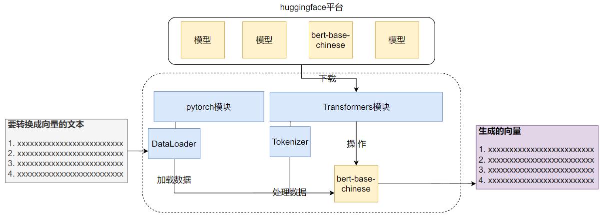

### 3. 补充，切片语法

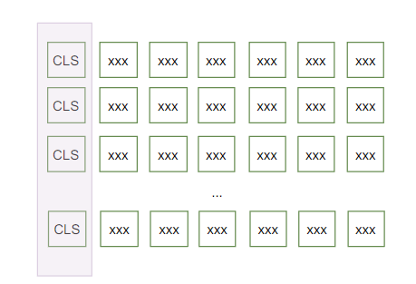

### 4. BERTopic使用本地保存的词向量

这基本是一个必须的步骤，否则每次运行BERTopic，都需要重新训练词向量，这个时间成本是不可接受的

生成词向量的时间是整个代码执行过程中最耗时的部分

`test/test-bertopic-use-emb目录`

还有一个`test\test-hugging-face\test-pipeline.ipynb`，测试了一下pipeline，可以不讲

## （五）实战：使用哈工大模型

[https://huggingface.co/hfl/chinese-bert-wwm](https://huggingface.co/hfl/chinese-bert-wwm)

[https://github.com/ymcui/Chinese-BERT-wwm?tab=readme-ov-file#%E4%B8%AD%E6%96%87%E6%A8%A1%E5%9E%8B%E4%B8%8B%E8%BD%BD](https://github.com/ymcui/Chinese-BERT-wwm?tab=readme-ov-file#%E4%B8%AD%E6%96%87%E6%A8%A1%E5%9E%8B%E4%B8%8B%E8%BD%BD)

[https://github.com/ymcui/Chinese-BERT-wwm](https://github.com/ymcui/Chinese-BERT-wwm)

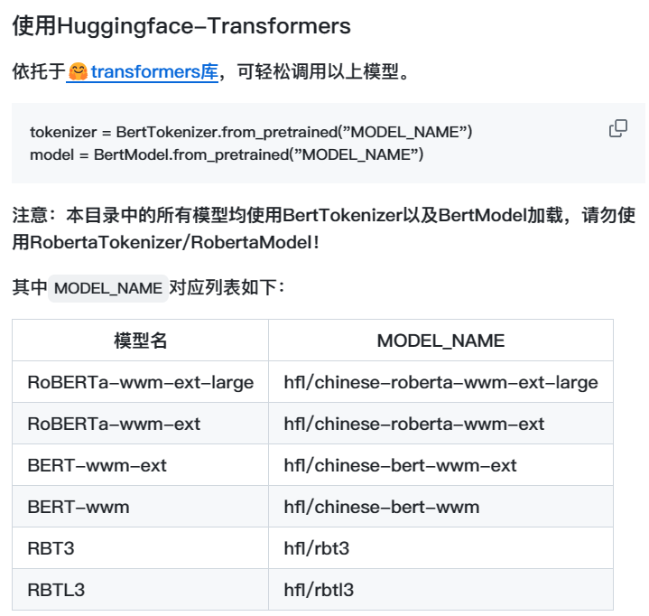

# 五、词向量：使用SentenceTransformers

## （一）理解：我们要做什么

前面我们学习了通过bert-base-chinese，还有哈工大模型生成词向量

这里我们要学习另外一个库：SentenceTransformers，它也可以将一个句子转换成词向量

其实SentenceTransformers是bertopic默认使用的文本转词向量工具，之所以将Sentencetransformers放在后面讲解，是因为这个模型的封装程度很高，大家直接学习这个框架很容易进入一种“知其然，但不知其所以然”的状态。先学习bert-base-chinese这一系列的模型，对理解Sentencetransformers有非常大的帮助

所以：本章我们学习怎么通过Sentencetransformers生成词向量

### 1. SentenceTransformers是什么

看他的名字就知道，**Sentence** transformers，这个模型的主要目的就是将句子转换成向量

其修改了 BERT模型， 使其更适合生成句子嵌入，模型的具体结构此处不做讲解，我们主要学习其用法，感兴趣的可以查看这篇文章

[Sentence-BERT（SBERT）模型介绍及Sentence Transformers库的使用 - 知乎](https://zhuanlan.zhihu.com/p/659682364)

使用的时候，我们也是通过SentenceTransformers这个库，从HuggingFace平台下载具体的模型，然后直接调用模型的encode方法，把文本编码为向量就可以了，用法非常简单

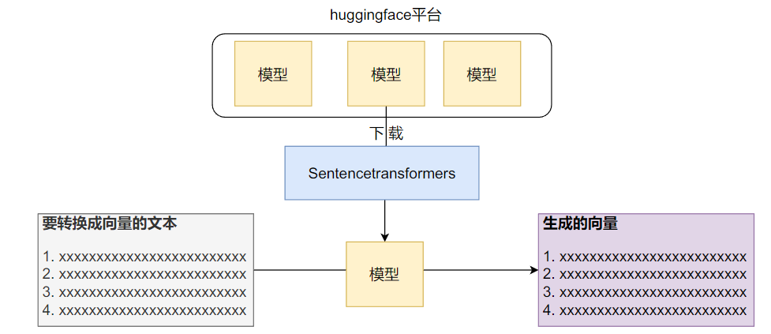

## （二）实战：入门实例

1. 下载安装

`pip install sentence-transformers`

We recommend `Python 3.8` or higher, and at least `PyTorch 1.11.0`

2. 代码实例

参见代码 `test_sentence-transformers.ipynb`

3. 文档

官方文档地址：推荐，写的比较容易看懂

[sbert](https://www.sbert.net/)

github地址：

[https://github.com/UKPLab/sentence-transformers](https://github.com/UKPLab/sentence-transformers)

## （三）理解：SentenceTransformers提供的模型

### 1. 模型列表

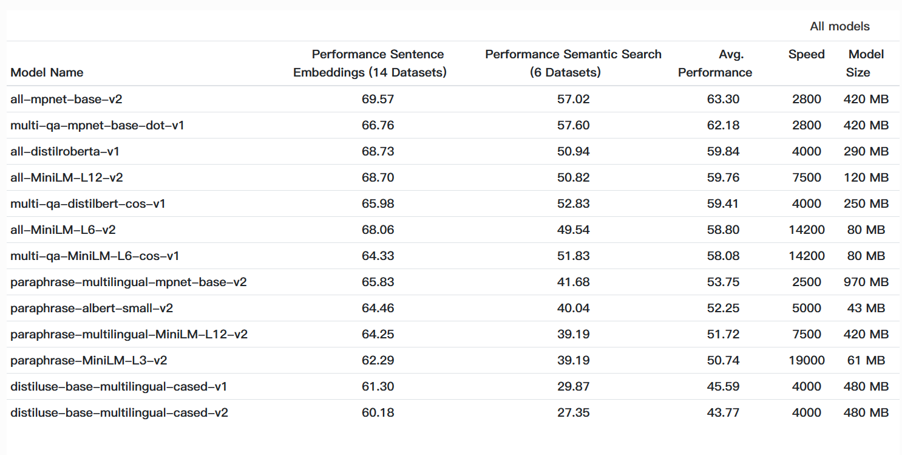

[https://www.sbert.net/docs/pretrained_models.html](https://www.sbert.net/docs/pretrained_models.html)

### 2. 模型参数

mean pooling：平均池化

平均池化：计算所有token输出向量的平均值作为整个句子的向量表示

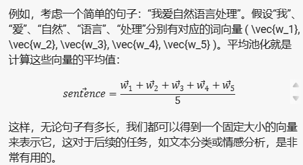

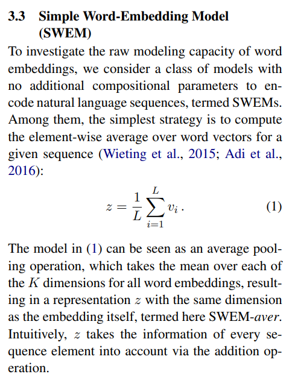

[https://aclanthology.org/P18-1041.pdf](https://aclanthology.org/P18-1041.pdf)

[Sentence-BERT（SBERT）模型介绍及Sentence Transformers库的使用 - 知乎](https://zhuanlan.zhihu.com/p/659682364)

> BERT (and other transformer networks) output for each token in our input text an embedding. In order to create a fixed-sized sentence embedding out of this, the model applies mean pooling, i.e., the output embeddings for all tokens are averaged to yield a fixed-sized vector.

[Quickstart — Sentence-Transformers documentation](https://www.sbert.net/docs/quickstart.html)

## （四）实战：使用paraphrase-multilingual-MiniLM-L12-v2模型

### 1. 实例paraphrase-multilingual-MiniLM-L12-v2生成词向量

首先，该模型是Bertopic的默认模型选择（做处理多语言文本时）

>  The default embedding model is `all-MiniLM-L6-v2` when selecting language="english" and `paraphrase-multilingual-MiniLM-L12-v2` when selecting language="multilingual".

[BERTopic - BERTopic](https://maartengr.github.io/BERTopic/api/bertopic.html#bertopic._bertopic.BERTopic)

生成向量：`embedding\embedding_sentence_transformer.ipynb`

与BERTopic集成：`test\test-bertopic-use-emb-2`

### 2. 与BERTopic结合使用

### 3. 使用CUDA

无需自行指定，如果CUDA可用，会自动在CUDA运行

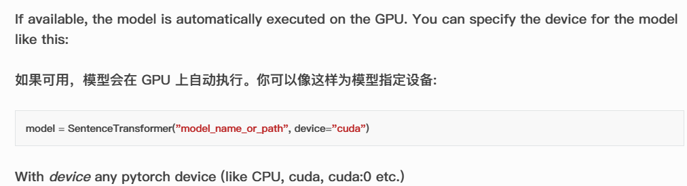

## （五）问题：长文本编码问题（使用其他模型）

### 1. 问题提出

SentenceTransformers官网提供的这几个预训练模型的缺点是：其中支持中文的模型，其max sequence length都比较短，比如只支持128个字符

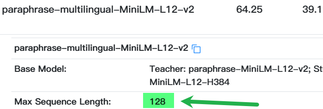

大体上可以理解为它至多只能处理128个中文字符，当长度超过128时，会被自动截断

下面是官网截图

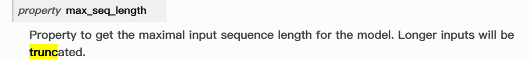

[SentenceTransformer — Sentence-Transformers documentation](https://www.sbert.net/docs/package_reference/SentenceTransformer.html#sentence_transformers.SentenceTransformer.max_seq_length)

stackoverflow中对该问题也有相关讨论

[nlp - Huggingface pretrained model's tokenizer and model objects have different maximum input length - Stack Overflow](https://stackoverflow.com/questions/71691184/huggingface-pretrained-models-tokenizer-and-model-objects-have-different-maximu/71714293#71714293)

要注意paraphrase-multilingual-MiniLM-L12-v2这个模型，虽然它的max sequence length长度是128，其实在编码中文时，真正可编码的长度是要略大于128的

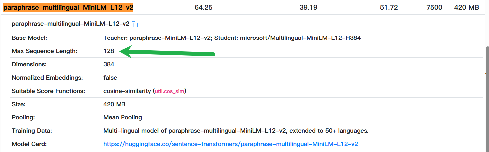

这和其词表vocabulary有关，其词表中，有一些中文是多个字符并列在一起对应一个token的

举例：下面这个图代表“海域”，这两个汉字会变编码成一个inputid，即182769

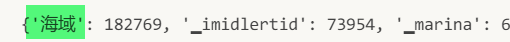

代码示例：`test_sentence-transformers-modal-max-len.ipynb`

### 2. 解决方法1：不好的解决办法 ❌

官方文档中说可以去设置模型的max_seq_length参数

比如下面就将最大序列长度设置为200

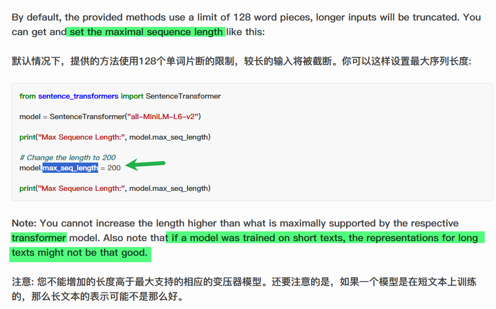

但这样有很大的局限性：

其一是，它不能超过对应的transformer模型支持的最大长度，比如512字符

其二是，如果该模型是在短文本上训练的，那么他对短文本进行语义编码效果会比较好，强行设置max_seq_length来增强输入长度，可能会导致不好的训练效果

下面这个stackoverflow页面有更详细的解释

[nlp - max_seq_length for transformer (Sentence-BERT) - Stack Overflow](https://stackoverflow.com/questions/75901231/max-seq-length-for-transformer-sentence-bert)

总之个人觉得该解决方法不是特别好

### 3. 解决方法2：换用其他模型

#### SentenceTransformers文档

官方文档中说，在huggingface可以找到更多适用于sentence-transformer的模型

[https://www.sbert.net/docs/hugging_face.html](https://www.sbert.net/docs/hugging_face.html)

比如：这个模型，支持512字符

[BAAI/bge-large-zh-v1.5 · Hugging Face](https://huggingface.co/BAAI/bge-large-zh-v1.5)

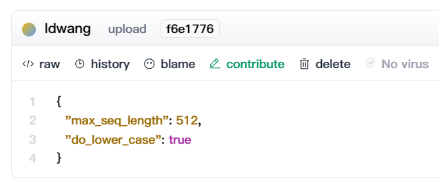

#### BERTopic文档

BERTopic官方文档中推荐去看MTEB排行榜，其中许多模型可以和SentenceTransformers集成

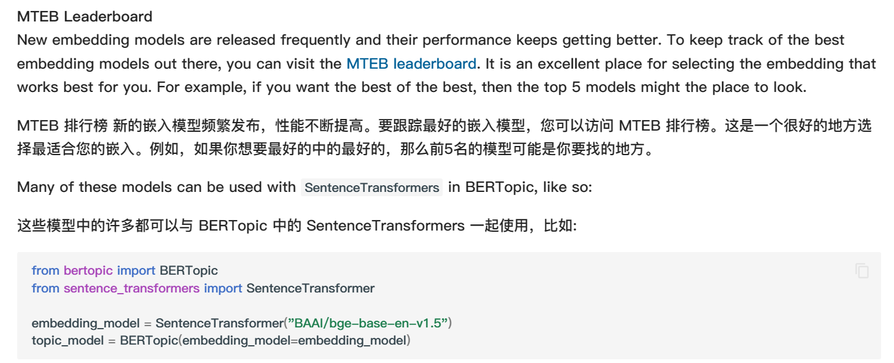

[FAQ - BERTopic](https://maartengr.github.io/BERTopic/faq.html#which-embedding-model-should-i-choose)

比如下面这个模型，它支持的token可以达到1024个

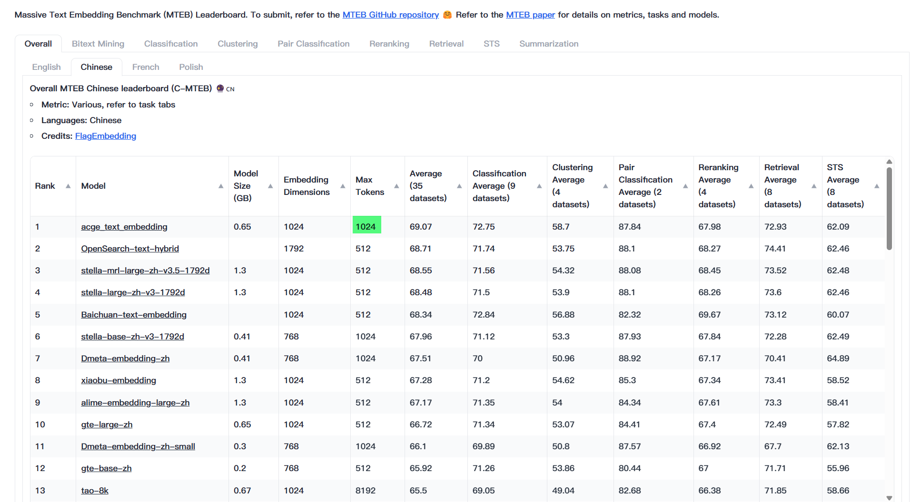

[MTEB Leaderboard - a Hugging Face Space by mteb](https://huggingface.co/spaces/mteb/leaderboard)

# 六、词向量：使用线上平台加快训练效率（AutoDL）

## （一）理解：我们要做什么

用本地cpu训练词向量还是太慢了，让我们使用线上平台gpu进行加速！

## （二）实战：流程

### 1. 租用实例

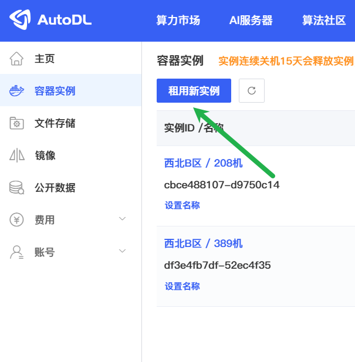

### 2. 创建实例

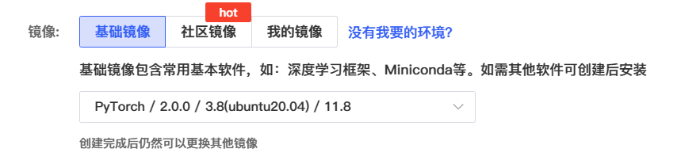

# 七、BERTopic：主题聚类

## （一）理解：我们要做什么

使用BERTopic进行文本聚类

## （二）理解：BERTopic模型（让我们手动拼装一个BERTopic模型）

### 1. 官网地址

[BERTopic](https://maartengr.github.io/BERTopic/#quick-start)

### 2. 代码：从一个最简单的案例开始

代码：`test\test-bertopic\1_quick_start\1_quick_start.ipynb`

### 3. 理解：它是怎么完成文本聚类的？

官方文档

[The Algorithm - BERTopic](https://maartengr.github.io/BERTopic/algorithm/algorithm.html)

对照这个代码进行讲解：`test\test-bertopic\2_the_algorithm.ipynb`

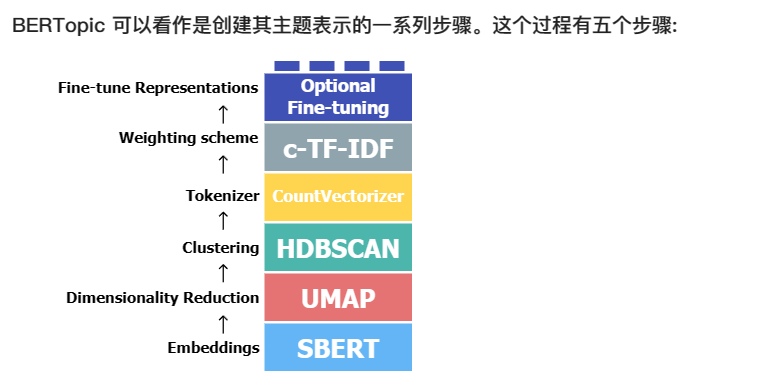

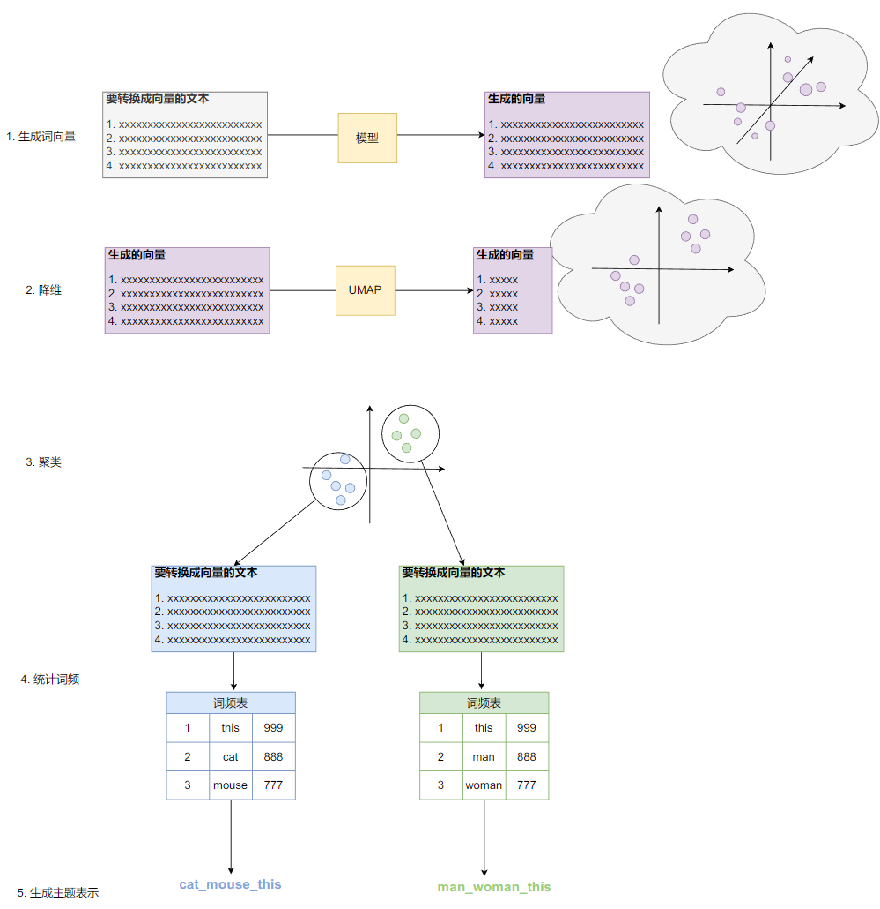

#### 第一步：生成词向量 SentenceTransformers

[The Algorithm - BERTopic](https://maartengr.github.io/BERTopic/algorithm/algorithm.html#2-dimensionality-reduction)

#### 第二步：降维 UMAP

减少运算量

[How to Use UMAP — umap 0.5 documentation](https://umap-learn.readthedocs.io/en/latest/basic_usage.html)

#### 第三步：聚类 HDBSCAN

[Basic Usage of HDBSCAN* for Clustering — hdbscan 0.8.1 documentation](https://hdbscan.readthedocs.io/en/latest/basic_hdbscan.html)

#### 第四步：分词 CountVectorizer

#### 第五步：生成表示 c-TF-IDF

简而言之：tf-idf：如果一个词语在一篇文章中出现次数越多, 同时在所有文档中出现次数越少, 该词就越能够代表该文章

c-tf-idf：我们聚类之后，一个类中不是会包含很多条文档吗。我们把这多条文档视为1篇文档即可。比如我们聚类出来10个类，平均每个类包含500条微博，那我们就把它视为10篇文章，每篇文章由500条微博拼装而成。

这样，在一篇文章中（其实就是一个主题中，或者说在这500条微博中），这个词语出现次数越多，同时在其他主题中出现次数越少，它就越能代表该主题

关于td-idf感兴趣的可以看这个

[TF-IDF 原理与实现 - 知乎](https://zhuanlan.zhihu.com/p/97273457)

官方文档

[The Algorithm - BERTopic](https://maartengr.github.io/BERTopic/algorithm/algorithm.html)

代码示例

[BERTopic/tests/test_vectorizers/test_ctfidf.py at 424cefc68ede08ff9f1c7e56ee6103c16c1429c6 · MaartenGr/BERTopic](https://github.com/MaartenGr/BERTopic/blob/424cefc68ede08ff9f1c7e56ee6103c16c1429c6/tests/test_vectorizers/test_ctfidf.py#L37)

#### 注意：各个模块也可以换成其他算法

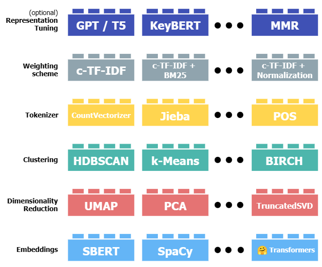

#### 理解：为什么要介绍这些模块？

很大程度上，BERTopic参数的调节，就是在调节上述各个模块的参数

## （三）实战代码：主题聚类

### 1. 代码

### 2. 优化1：支持汉语，使用jieba分词

`test\test-bertopic\3_use_jieba.ipynb`

### 3. 优化2：缓存切词结果

### 4. 优化3：缓存Embedding和切词结果

#### 为什么

这是两个很耗时的操作，我们可以都先做好，把结果保存起来

注意在做Embedding的时候，不要做切词之类的预处理，可以仅去除emoji表情、html标签之类的

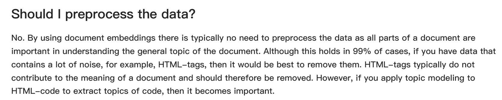

[FAQ - BERTopic](https://maartengr.github.io/BERTopic/faq.html#why-does-it-take-so-long-to-import-bertopic)

bert模型在训练时，会相对完整的保存上下文，我们在使用bert预训练模型时，最好也保持同样行为

[BERT分词，wordpiece，BPE，jieba，pkuseg_bert分词和jieba分词-CSDN博客](https://blog.csdn.net/DecafTea/article/details/114526213)

这里也提到在生成词向量的时候，不要去除停用词。

而是先使用原始文本生成词向量，降维，聚类，之后再进行切词并移除停用词

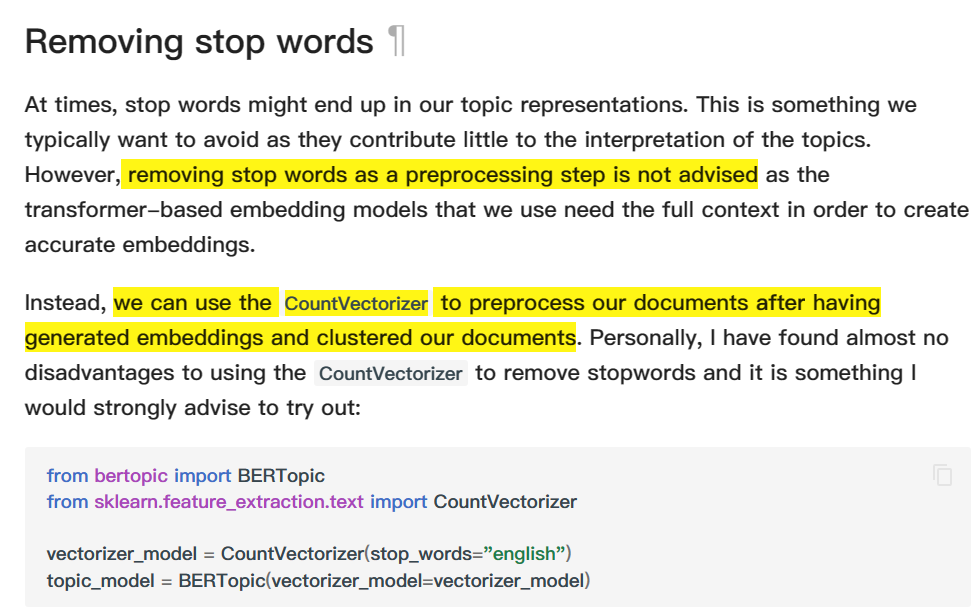

[https://maartengr.github.io/BERTopic/getting_started/tips_and_tricks/tips_and_tricks.html#document-length](https://maartengr.github.io/BERTopic/getting_started/tips_and_tricks/tips_and_tricks.html#document-length)

#### 重点理解BERTopic的执行顺序

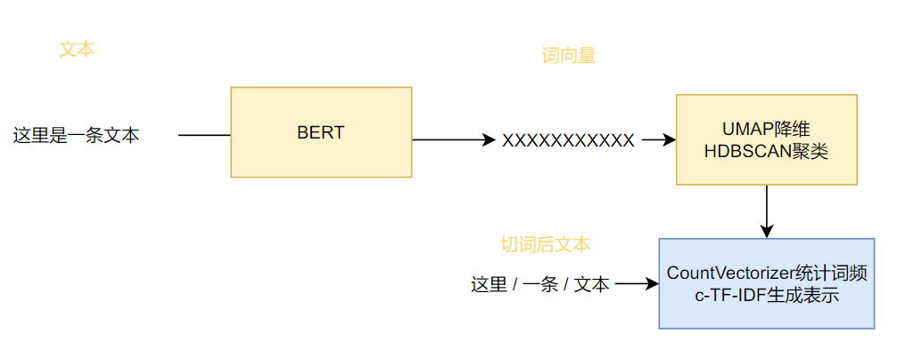

#### 代码

`test\test-bertopic\4_use_emb_jieba.ipynb`

### 5. 超参数调节1：UMAP的`random_state`，防止结果随机

代码`test\test-bertopic\5_random_state.ipynb`

大家很快会发现运行结果和我的不一样

并且每次重新运行这个单元格，出来的结果也不一样

这是因为UMAP的随机数种子的问题

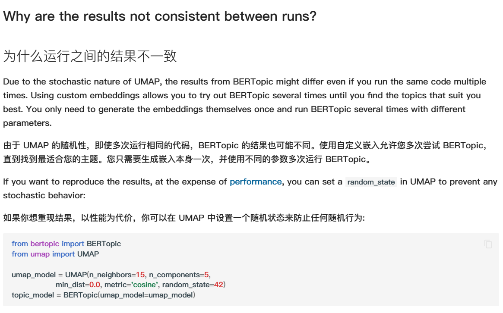

[FAQ - BERTopic](https://maartengr.github.io/BERTopic/faq.html)

设置这个随机数种子可能会降低运行效率

但这对于我们做项目、写论文结果的可复现性极其重要，所以一般推荐设置一下

⚠️ 但事实上我发现这个随机数对离群值的影响还挺大的，如果想要降低离群值，也可以尝试调节该参数，但要注意结果的可解释性

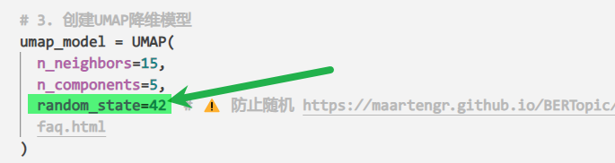

### 6. 超参数调节2：min_topic_size，设置一个类中最少需要包含多少文档

可以使用该代码进行展示`test\test-bertopic\5_random_state.ipynb`

#### 设置经验

一个类中最少需要包含多少文档

增大这个值会：导致聚类数量变少，同时每个聚类中包含的文档变多

减少这个值：则聚类变多，同时每个聚类中的文档变少

这个超参数怎么设置取决于自己的需求：

如果想要得到更多的主题，则需要将该值设置的小 一些

如果只想得到几个大的主题，则设置的大一些

⭐ 此外，测试时发现，把这个值设置小 一些，可能有利于减少离群值

#### 什么是离群值

这是HDBSCAN这种聚类算法带来的

简单来说就是：使用HDBSCAN进行聚类时，并不是所有的文档都会被分给某一类别，某些文档可能主题并不清晰，分到哪个类别都不合适，因此会被分配为离群值outliers，以保证其他主题生成的准确性。

[Outlier Detection — hdbscan 0.8.1 documentation](https://hdbscan.readthedocs.io/en/latest/outlier_detection.html)

但说实话，真正使用bertopic的时候，生成的离群值往往是较多的。

在官方的这个issue当中，甚至认为过半的离群值也属于正常现象

[What if I have too many documents labelled in -1 cluster in bertopic? · Issue #1298 · MaartenGr/BERTopic](https://github.com/MaartenGr/BERTopic/issues/1298)

在参数调节中，大家可以看到许多减少离群值的手段，包括前文提及的`random_state`、此处提及的`min_topic_size`，后文还会再介绍一些，如果实在不愿意接受离群值，也可以改用其他的聚类算法，比如k-means

### 7. 超参数调节3：HDBSCAN的`min_cluster_size`、`min_samples`减少离群值

代码：`test\test-bertopic\6_hdbscan.ipynb`

前文说过，离群值主要是HDBSCAN算法带来的，也可以通过调节该模块的参数来降低离群值

下面是官方文档

[Frequently Asked Questions — hdbscan 0.8.1 documentation](https://hdbscan.readthedocs.io/en/latest/faq.html)

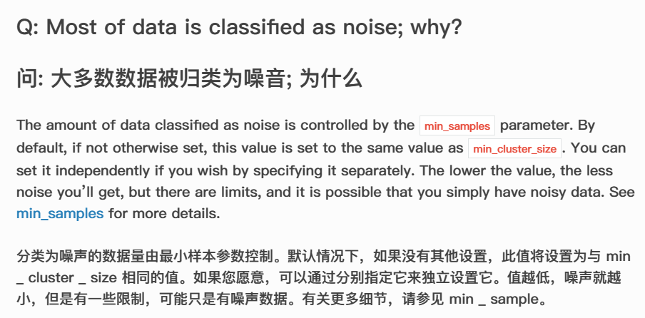

大家可以看一下官方文档的解释⭐

[Parameter Selection for HDBSCAN* — hdbscan 0.8.1 documentation](https://hdbscan.readthedocs.io/en/latest/parameter_selection.html)

注意，设置hdbscan_model的min_cluster_size，就不用设置min_topic_size了

github的issue也有提及：Do note though that if you using the min_cluster_size of HDBSCAN, you can skip min_topic_size

The min_topic_size parameter is exactly the same parameter as min_cluster_size but merely a nice way of controlling the min_cluster_size without the need to use custom cluster models

[https://github.com/MaartenGr/BERTopic/issues/1642](https://github.com/MaartenGr/BERTopic/issues/1642)

### 8. 超参数调节4：CountVectorizer的stop_words，设置不显示重复出现的词

一些词出现次数太多了

还可以通过countVectorizer的stop_words进行过滤

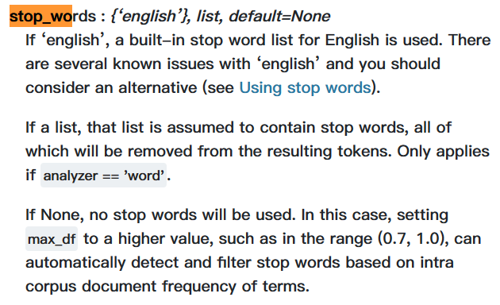

### 9. 超参数调节5：nr_topics，reduce_topics()合并主题（减少主题）

这里要注意几个问题

1. nr_topics=5，指定合并为几个主题

在写论文的时候会面临一个主题数量选择合理性解释的问题

2. nr_topics='auto'，自动合并主题

我测试了一下，有的时候该参数可能并不起效果，也就是不会减少主题

这个在一些论文中有用过

3. min_cluster_size和nr_topics

设置这两个超参数都可以调节主题数量

作者在这个回答中，说他更喜欢通过min_cluster_size控制主题

个人在实践的过程中也更倾向于设置HDBCSAN的两个超参数min_cluster_size、min_samples

但在一些论文中也涉及调节nr_topics，这两个都是合理的调解手段

Generally, I am more satisfied with the resulting topics using min_cluster_size compared to nr_topics. So I would advise skipping nr_topics.

[Very imbalanced topic proportion? · Issue #1423 · MaartenGr/BERTopic](https://github.com/MaartenGr/BERTopic/issues/1423)

### 10. 超参数调节6：UMAP的min_dist，BERTopic子模型的默认参数（有坑）

#### BERTopic的默认参数

`test\test-bertopic\16_default_args.ipynb`

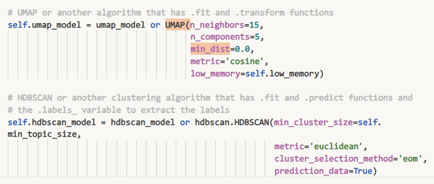

或者我们看一下官方文档是如何初始化的，可以遵循这个初始化

[The Algorithm - BERTopic](https://maartengr.github.io/BERTopic/algorithm/algorithm.html#code-overview)

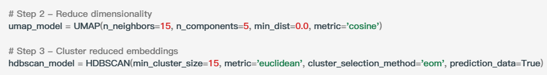

#### 坑在哪里 

可以用这个里头的例子来做演示`test\test-bertopic\7_counter.ipynb`

很多同学可能会这样初始化UMAP参数，因为对这三个参数比较熟悉

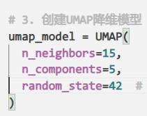

但这样很可能会大幅增加集群值，尤其是min_dist参数

应当这样初始化

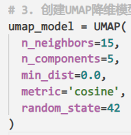

1. 关于metric参数

官方文档在参数调节中说了，他默认使用的是cosine

对于高维数据计算相似度，使用cosine是一个更合理的选择。

[Parameter tuning - BERTopic](https://maartengr.github.io/BERTopic/getting_started/parameter tuning/parametertuning.html#umap)

关于为什么用cosine更合适，可以参考下面这篇文章

[为什么高维空间下距离度量逐渐失效？ - 知乎](https://zhuanlan.zhihu.com/p/87134706)

2. 关于min_dist参数

其代表低维空间中点之间的最小距离

个人理解是这个值设置的越小，低维空间中的向量之间就可以挨的越紧密，这个值越大，向量之间就会越松散

查看一下UMAP的源码，可以发现这个数值默认是0.1

而BERTopic框架则将这个值设置为了0.0，可以显著减少了离群值，建议该参数与bertopic的官方参数保持一致

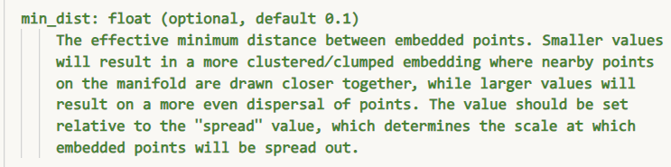

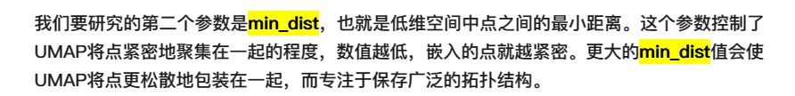

[[译] 理解 UMAP(2): UMAP和一些误解 - 知乎](https://zhuanlan.zhihu.com/p/352461768)

3. HDBCSAN的prediction_data参数

BERTopic框架将HDBCSAN的prediction_data会被设为true，不过这个参数对聚类结果好像影响不大

但在BERTopic生成文档对主题概率时，该参数必须设置为True，否则会报错

### 11. 减少离群值：reduce_outliers()

#### 先了解topic_model.fit_transform的输出

代码：`test\test-bertopic\9_understand_prob.ipynb`

#### 各种减少离群值的方式

代码：`test\test-bertopic\10_reduce_outlier.ipynb`系列

#### 注意：减少离群值，然后更新主题之后，topic的id不会按主题数量进行重新排列，而是和老的主题保持对照关系

比如下面的count就没有按数值排列

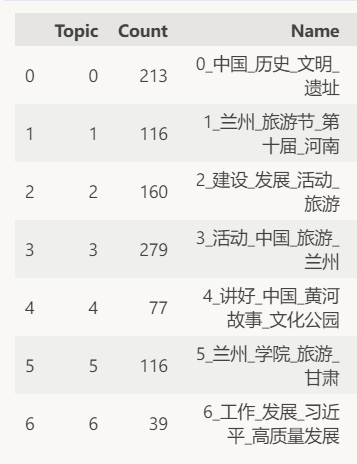

作者在issue中提及，这是故意设计的

目的是方便进行新老主题的对比

[reduce_outliers followed by update_topics: resulting get_topic_info() does not sort by new Count · Issue #1448 · MaartenGr/BERTopic](https://github.com/MaartenGr/BERTopic/issues/1448)

#### 注意：更新主题后，再使用主题缩减或主题合并，可能会出现错误

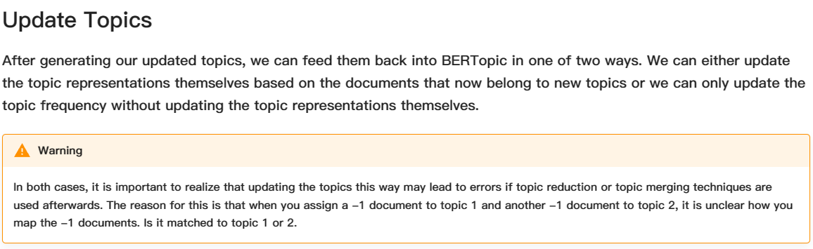

[https://maartengr.github.io/BERTopic/getting_started/outlier_reduction/outlier_reduction.html#chain-strategies](https://maartengr.github.io/BERTopic/getting_started/outlier_reduction/outlier_reduction.html#chain-strategies)

这点我觉得有点纳闷，因为减少离群值之后再进行主题合并，其实是一个比较常见的需求

我测试了一下，在这个案例中也没有报错，这个有点奇怪

#### 注意：官方文档和代码有不一致的地方

官方文档中说默认使用c-tf-idf策略

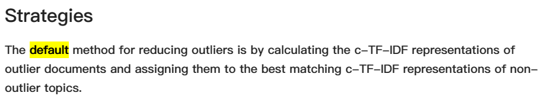

[https://maartengr.github.io/BERTopic/getting_started/outlier_reduction/outlier_reduction.html](https://maartengr.github.io/BERTopic/getting_started/outlier_reduction/outlier_reduction.html)

但是在代码中说的是默认使用distribution的策略

建议大家在用的时候还是手动指明一下使用什么策略

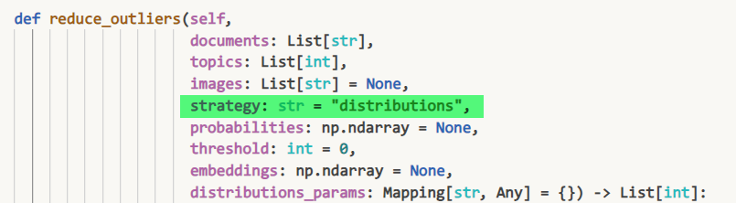

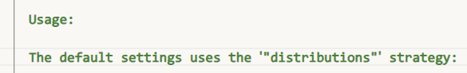

#### 注意：一个小坑，update_topics()、merge_topics()之后，如何拿到最新的topic列表

print(topic_model.topics_)

#### 个人理解：国内的论文现在还是保留离群值的稍多一些

如果我们不想保留离群值，该如何论述呢

1. 我个人觉得，首先官方文档中专门给出了一系列减少离群值的方法，证明这是一个普遍的需求

2. 其次可以汇报一下UMAP图案，如果各主题划分比较明确，应该还是比较有说服力的

不过当文档数量较大的时候，一般来说UMAP图像很可能会出现一定重叠，可能会存在无法说服审稿人的情况

比如下面这个官方案例中就存在重叠

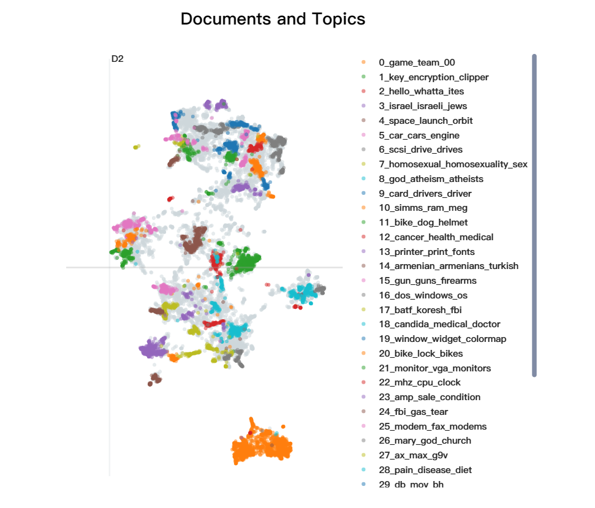

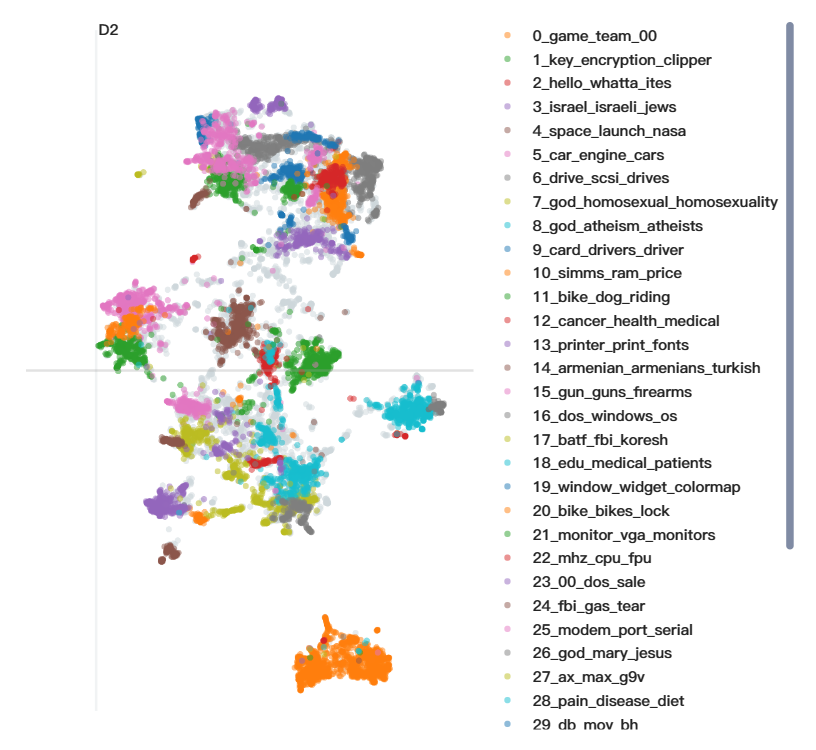

[https://maartengr.github.io/BERTopic/getting_started/outlier_reduction/outlier_reduction.html#exploration](https://maartengr.github.io/BERTopic/getting_started/outlier_reduction/outlier_reduction.html#exploration)

3. 最后一点是个人看法，我仔细查看过那些被分配为离群值的文档，我发现其实有一些还是挺符合某些主题的，感觉不是特别应该被划分为离群值。而且在具体分析中，过多的语料被划分为离群值，也会使得某一些信息被遗漏。如果这种信息遗漏对于我们的分析来说是不可接受的，则应该想办法减少离群值

4. 如果特别不想要离群值，也可以改换其他聚类算法，比如k-means

#### 总结：减少离群值的主要策略

HDBSCAN的min_samples

UMAP的min_dist

reduce_outliers()

HDBSCAN的min_cluster_size

UMAP的random_state

清理数据

### 12. 合并主题：merge_topics()

#### 代码

`test\test-bertopic\12_merge_topic.ipynb`

#### 注意：和减少离群值不同的是，合并主题之后是按照count倒序排列的

#### 注意：事实上，合并主题经常和层次主题模型搭配使用

这个后文我们再说

### 13. 调整主题表示：Representation Models

#### 是什么

回到算法章节

可以看到在c-tf-idf 算法之上还有一个可选的representation model

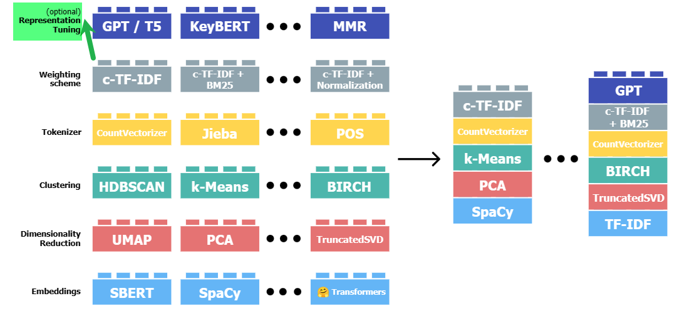

这个意思是在说，本来我们各个主题的主题表示，或者说主题名字，是根据c-tf-idf算法计算出来的最能代表当前主题的词，但这些词可能还存在一些问题

比如其中可能存在一些重复的词，虽然这些词能够代表当前主题，但是重复词汇让标题显得冗余，缺乏多样性

这时候我们可以通过 最后一层来优化一下主题表示

#### 案例：MMR

代码：`test\test-bertopic\13_mmr.ipynb`

 Mmr是一个重排序算法，它的作用简单来说就是

 减少冗余结果，在保证相关性的同时增强主题表示的多样性

 

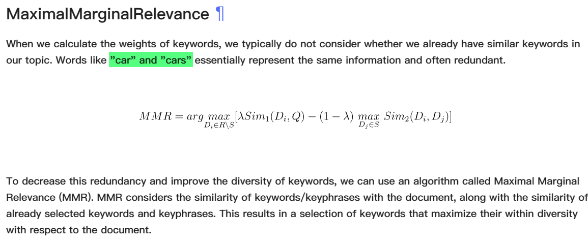

 

[推荐重排算法之MMR - 知乎](https://zhuanlan.zhihu.com/p/102285855)

#### 官方文档

[6A. Representation Models - BERTopic](https://maartengr.github.io/BERTopic/getting_started/representation/representation.html#partofspeech)

#### 注意：默认情况下，BERTopic主题词不是按词频排序，而是按贡献度排序的

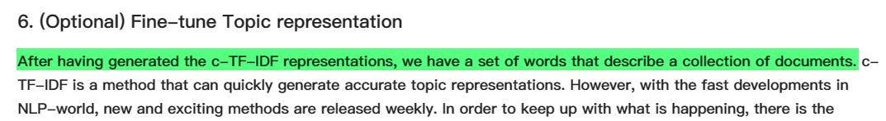

许多同学看到下面的这个representation，可能会下意识觉得这是按词频排序的，但按照文档的说法，它应该是按照c-tf-idf的贡献度排序的。这点在论文汇报的时候要加以注意

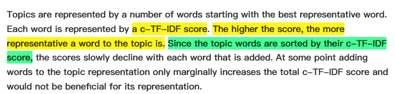

[Terms - BERTopic](https://maartengr.github.io/BERTopic/getting_started/visualization/visualize_terms.html)

### 14. 聚类模型：使用k-means

#### 好处

无需处理离群值问题

#### 坏处

k-means的主题个数，需要通过困惑度等算法进行确定，不能自己凭感觉写。而HDBCSAN无需提前确定主题个数

#### 代码

### 15. Embedding模型：使用不同的Embedding模型

`test\test-bertopic\15_embedding_modal.ipynb`

其实换用不同的词嵌入模型也是优化我们整个代码输出，减少离群值，或者让结果更有可解释性的重要工作

### 16. 保存聚类结果：get_document_info()

`test\test-bertopic\17_save_topics.ipynb`

## （四）实战代码：可视化

### 1. 术语层级：条形图

#### 可视化

#### 修改标签名

#### 下载图像

### 2. 主题层级：LDAvis

#### 如果主题重叠

如果主题数量较多，那么发生重叠是合理的

如果有需要的话：可以通过前文的主题合并方法，将重叠的主题进行合并

如果主题数量少，仍发生重叠

可以调整前文讲的各类超参数

#### 调试经验

但我个人在调试代码的时候，发现一些比较微妙的地方

1. 首先是这个主题分布图中，距离相近的主题，有时候语义上并不一定相近。

可能按照该图片进行合并，合并着合并着会发现还是会出现圆圈之间的重叠

2. 想要得到相互分散的圆圈，有时候不止一种合并方法

不参照圆圈之间的相似度，而是按语义或者层次聚类结果进行主题合并，可能也会得出较好的结果

3. 这个主题分布图可能会和UMAP的散点图相冲突

比如散点图中的各个簇可能结构非常清晰，但主题分布图可能会挤在一块

个人理解，这可能是和这两种图的计算方式不同有关系

umap的散点图是对文档Embedding进行降维，而后聚类

这里则是对主题的c-tf-idf表示进行降维而后聚类

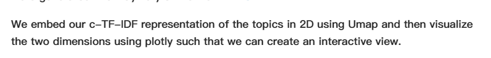

[Topics - BERTopic](https://maartengr.github.io/BERTopic/getting_started/visualization/visualize_topics.html)

4. 从合并主题的视角而言，我们可以参照如下内容

一是这里的主题分布图

二是UMAP的散点图

三是后文要讲到的层次主题聚类中的层次结构

同时还可以结合自己的认知进行调整

#### 报错处理：主题数量太少了

[TypeError: Cannot use scipy.linalg.eigh for sparse A with k >= N. Use scipy.linalg.eigh(A.toarray()) or reduce k. · Issue #1512 · MaartenGr/BERTopic](https://github.com/MaartenGr/BERTopic/issues/1512)

### 3. 文档层级：UMAP

n_components默认参数

[https://maartengr.github.io/BERTopic/getting_started/outlier_reduction/outlier_reduction.html#update-topic-representation](https://maartengr.github.io/BERTopic/getting_started/outlier_reduction/outlier_reduction.html#update-topic-representation)

### 4. 其他可视化方式

[Hierarchy - BERTopic](https://maartengr.github.io/BERTopic/getting_started/visualization/visualize_hierarchy.html#visualize-hierarchical-documents)

# 八、BERTopic：层次主题模型

## （一）理解：我们要做什么

寻找到主题之间潜在的层次结构，自动划分主题层次

适用于主题比较多，需要对主题进行分类的场景

## （二）理解：原理

### 1. 原理

简而言之就是，每个主题都有一个c-TF-IDF表示 

将c-tf-idf相近的主题，相连形成新的主题，并重新计算新主题的c-TF-IDF 

就这样自下而上地，一点一点的把主题给连接起来，就形成了一个层次结构

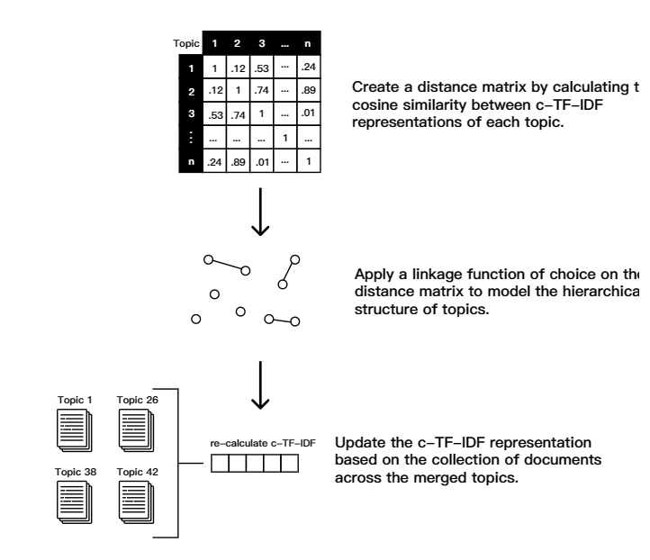

[Hierarchical Topic Modeling - BERTopic](https://maartengr.github.io/BERTopic/getting_started/hierarchicaltopics/hierarchicaltopics.html)

合并算法实际上使用的是scipy中的层次聚类函数

scipy是Python的一个科学计算库

[Hierarchical clustering (scipy.cluster.hierarchy) — SciPy v1.13.0 Manual](https://docs.scipy.org/doc/scipy/reference/cluster.hierarchy.html)

### 2. c-tf-idf

这个我们前面讲过

按照官方文档其实就是：用这个主题当中每个词的重要性得分（这是一个数值），来将这个主题转换为向量

进而可以计算主题间的相似度

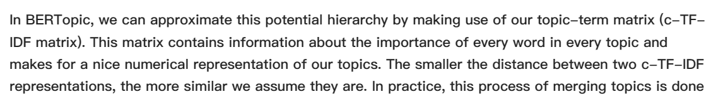

## （三）代码

### 1. 代码

`test\test-bertopic\31_hierarchical.ipynb`

### 2. 合并主题

此处的层次聚类结果是我们合并主题的重要参考

前文的主题分布的圆圈图也是重要参考

注意不是说必须按照此处的层次聚类结果进行主题合并，因为官方文档中有提及，层次聚类的合并结果可能是符合逻辑的，也可能不符合逻辑

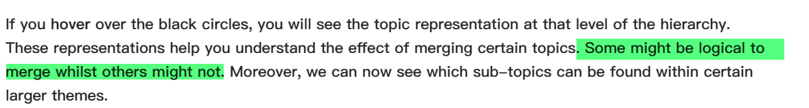

[Hierarchical Topic Modeling - BERTopic](https://maartengr.github.io/BERTopic/getting_started/hierarchicaltopics/hierarchicaltopics.html#visualizations)

一定程度上我们可以结合自己的背景知识，结合这里的层次聚类结果，来进行更合理的主题合并

### 3. 报错：TypeError: Cannot use scipy.linalg.eigh for sparse A with k >= N

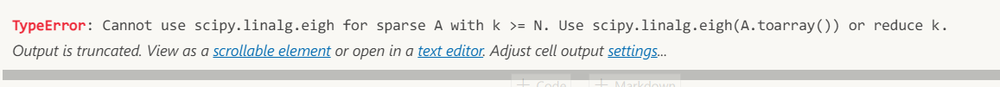

可能是主题数太少了，建议增加主题数

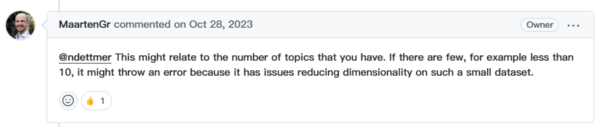

[TypeError: Cannot use scipy.linalg.eigh for sparse A with k >= N. Use scipy.linalg.eigh(A.toarray()) or reduce k. · Issue #1512 · MaartenGr/BERTopic](https://github.com/MaartenGr/BERTopic/issues/1512)

# 九、BERTopic：动态主题模型

## （一）理解：我们要做什么

可以用动态主题模型来分析主题随时间的演变

比如过去关心什么，现在不再关心了

## （二）理解：原理

首先我们要准备两个文档，一个是文本文档，其中每行是一个文本

另外一个是时间文档，对应每个文本的时间

这样我们就知道每个文档是在哪个时刻发表的了

经过前面的主题聚类，我们的文档被分成了几个topic

然后对于每个topic，都可以按照时间进行切分

比如对于旅游这一个topic，可能2011年讨论的是这个，2012年讨论的就是那个了，每年讨论的内容都不一样

我们就把旅游这个topic按年进行拆分，并且计算它的c-TF-IDF，

也就是找到最能代表旅游这个topic在2011年、2012年...的代表性词汇，这就是旅游这个topic在当年的主要讨论内容

最后模型还衔接了一个微调的过程：包含一个全局微调和演化微调

全局微调的含义是：比如（旅游在2012年主要讨论的主题 + 旅游整个话题讨论的主题）  / 2 ，也就是将全局信息混入到每一年的信息当中

演化微调则是：比如（旅游在2011年主要讨论的主题 + 旅游在2012年主要讨论的主题）  / 2 ，也就是将前一年的信息混入到这一年当中，以得到更加平滑的主题表示

这两个微调都是默认开启的，但这其实会导致一些问题，我们后文再说

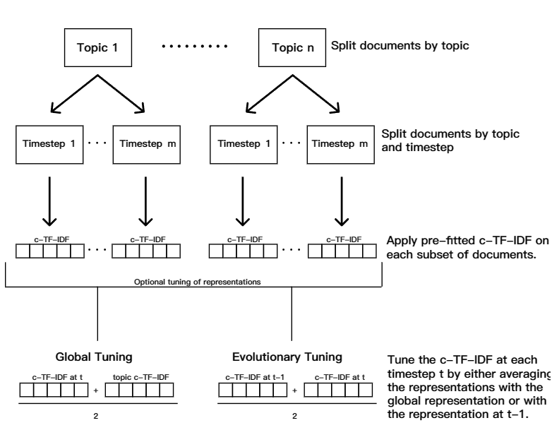

## （三）代码

### 1. 代码

`test\test-bertopic\32_dtm.ipynb`

### 2. 参数：global_tuning、evolutionary_tuning的调整

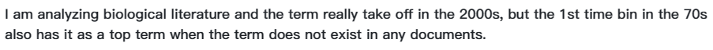

[https://github.com/MaartenGr/BERTopic/issues/688](https://github.com/MaartenGr/BERTopic/issues/688)

# 十、总结代码 & 文档概览 & 使用经验

## （一）总结代码

`main.ipynb`

## （二）经验：清理数据

通过主题聚类清理文本

## （三）经验：回归原文

## （四）经验：有的时候会生成一个超级大的主题

比如一个超级大的topic -1，或者topic 0主题

这一个主题可能会占到百分之80或90的文档，剩下的只有一两个很小的主题

个人理解，这个时候一般是有问题的，需要重新调节超参数，尤其是`min_cluster_size` `min-sample`参数

作者在相关回答中提及确实会发生这种现象，这是由于HDBSCAN这种聚类算法的特性决定的，该算法可以识别出文档中大小不同的簇

[Very imbalanced topic proportion? · Issue #1423 · MaartenGr/BERTopic](https://github.com/MaartenGr/BERTopic/issues/1423)

但个人认为，如果出现上面这种极端比例划分，还是应该调整一下

此时可以调整模型超参数，或者换为k-means聚类之类的结果往往更加均衡

## （五）经验：在写论文的时候，可能要调节上百次各类参数，对此，BERTopic文档中如下章节尤为重要

1. [FAQ - BERTopic](https://maartengr.github.io/BERTopic/faq.html)

2. [Best Practices - BERTopic](https://maartengr.github.io/BERTopic/getting_started/best_practices/best_practices.html)

3. [Parameter tuning - BERTopic](https://maartengr.github.io/BERTopic/getting_started/parameter%20tuning/parametertuning.html)

4. [Tips & Tricks - BERTopic](https://maartengr.github.io/BERTopic/getting_started/tips_and_tricks/tips_and_tricks.html#removing-stop-words)

## （六）经验：善用github issue

现在这个项目相当活跃，项目的开发者的回复也很积极

实在有问题难以解决，可以去这里提问

1. 保持礼貌

2. 使用英文

3. 清晰描述，最好带上你的环境、出问题的代码和报错信息等

如BERTopic的版本号等信息

4. 提前先检索，不要重复提问